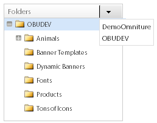

# 關於橫幅 {#about-banners}

您可以使用橫幅來管理您網站上的橫幅廣告。

## 使用橫幅 {#concept_5BBE01FEC6134393B43CC917C8CC64DA}

<!-- 

c_about_banners.xml

 -->

您可使用兩種方法將橫幅廣告新增至網站。

第一種方法是透過Target、Search&amp;Promote新增橫幅。 橫幅是HTML程式碼片段，客戶在搜尋您的網站時會顯示。 您的橫幅可以包含GIF、JPEG或PNG格式的文字或影像，或兩者的組合。 您可以從預設大小中選擇，或定義您自己的自訂尺寸以符合您的頁面。 您用來顯示橫幅的HTML程式碼也可以指定要使用的字型樣式和邊框等項目。 此新增橫幅的方法提供基本功能，而且不需要其他軟體。

第二種方法是使用動態媒體管理與發佈服務Adobe Dynamic Media Classic。 有效的Adobe Dynamic Media Classic帳戶可讓您使用Dynamic Media Classic，直接管理橫幅內容，並將其傳送至Target、Search&amp;Promote。 在網站搜尋／銷售中，您可設定Dynamic Media Classic帳戶的存取權。 然後，您開啟Dynamic Media Classic媒體瀏覽器，並選取要當做橫幅的動態媒體資產。

>[!NOTE]
>
>在您將動態媒體資產當做網站搜尋／銷售中的橫幅使用之前，會先在Scene7 Publishing System中上傳並準備發佈這些資產。 您可以從網站搜尋／銷售中上傳資產，並讓資產自動準備好供Scene7 Publishing System發佈。 或者，您可以從Scene7 Publishing System上傳和發佈資產。

## 橫幅與Adobe Scene7 Publishing System整合 {#section_D4D7ADEA6A6348E68EDA138E184FE579}

您可在網站搜尋／銷售中使用Dynamic Media Classic資產類型做為橫幅，包括影像、動態橫幅和範本，例如影像範本或Flash範本。

範本是動態建立和可定址的圖層影像檔案，例如Adobe Photoshop®等影像編輯應用程式中的圖層檔案。 與靜態影像檔案不同，範本可以包含參數。 透過參數，您可以自訂變數的影像屬性和影像內容。

>[!NOTE]
>
>您也可以使用Scene7 Publishing System中的「範本發佈」，以及Adobe Illustrator和Adobe InDesign的檔案，從版面設計建立範本。

請參 [閱Dynamic Media Classic](https://help.adobe.com/en_US/scene7/using/WSFBFBAD30-2694-4b18-B7CE-894F9FC5CDDF.html) (Scene7)使用指南中的範本發佈。

範本可以包含任意數量的影像圖層和文字圖層。 您可以將包含圖層（例如圖層PSD檔案）的靜態檔案轉換為範本，或在Dynamic Media Classic中建立範本。 您可以使用上傳至Scene7 Publishing System的字型，在範本中建立文字圖層。 將文字新增至範本後，您可以變更其對齊方式、字型、字型大小和顏色來設定其格式。

使用Dynamic Media Classic中的「參數」畫面，您可以將範本的任何方面轉換為可定址的參數。 在執行此動作時，您可以變更要使用的圖層影像或範本中要使用的文字值。 參數會隨URL字串傳遞，讓您變更任何參數，以動態自訂從影像伺服器產生的回覆影像。

您可以進一步瞭解如何使用Dynamic Media Classic建立範本，並為圖層上的屬性參數化，以便在橫幅中使用。

請參 [閱Dynamic Media Classic](https://help.adobe.com/en_US/scene7/using/WS60B68844-9054-4099-BF69-3DC998A04D3C.html) (Scene7)使用指南中的範本基礎。

**上傳和發佈資產**

您必須先在Dynamic Media Classic中上傳和發佈資產，才能在網站搜尋／銷售中將資產用於橫幅。 此先決條件也包含影像範本或Flash範本使用的任何資產。 使用您的Dynamic Media Classic帳戶來上傳和發佈數位資產。 或者，您可以使用網站搜尋／銷售來上傳數位資產，然後讓Dynamic Media Classic根據您的上傳設定自動為您發佈。 如果您嘗試挑選尚未上傳和發佈的資產，使用者介面會通知您，並提供在繼續之前上傳該資產的選項。

您可以進一步瞭解如何使用Scene7 Publishing System上傳和發佈數位資產。

請參 [閱Dynamic Media Classic](https://help.adobe.com/en_US/scene7/using/WS3673AD39-098B-4f08-8A24-CA51261B7366.html) (Scene7)使用指南中的上傳和發佈資產。

>[!NOTE]
>
>若要在Dynamic Media Classic資產檢視器中使用上傳功能，請確定您使用的Dynamic Media Classic帳戶已設定「SPS公司管理員」角色。

請參 [閱Dynamic Media Classic](https://help.adobe.com/en_US/scene7/using/WS662101DF-D697-47a7-A7D8-B52FD8E94438.html) (Scene7)使用指南中的管理設定。

**使用業務規則變更橫幅中的動態媒體傳統範本參數**

如果您將Dynamic Media Classic資產新增為橫幅，則可 [!DNL Visual Rule Builder] 在 [!DNL Business Rules] 中將它新增至網站上的任何橫幅區域。 例如，您將橫幅新增至搜尋結果頁面，就像您新增其他橫幅一樣。 您也可以根據您的特定需求自訂Dynamic Media Classic範本中的預設參數值，以覆寫這些值。 這類功能可讓您使用不同的行銷訊息和超連結來自訂Dynamic Media Classic範本至不同的端點。

另請參 [閱新增業務規則](../c-about-rules-menu/c-about-business-rules.md#task_BD3B31ED48BB4B1B8F1DCD3BFA2528E7)。

另請參閱 [編輯業務規則](../c-about-rules-menu/c-about-business-rules.md#task_375CFA75D1D94D9E92A35DE1228E5087)。

## 新增橫幅 {#task_549D02B5F73B4158B105A94E39D937B7}

您可以使 [!DNL Banners] 用來管理橫幅廣告，以及廣告放在您網站上的位置。 當您新增橫幅時，會透過在搜尋時顯示的HTML程式碼片段，在外部參照影像。

<!-- 

t_adding_a_new_banner.xml

 -->

如果您有有效的Adobe Dynamic Media Classic帳戶，則可透過Scene7 Publishing System新增橫幅廣告。

請參 [閱「使用Adobe Dynamic Media Classic新增橫幅」](../c-about-design-menu/c-about-banners.md#task_AD1E0C00A9E04B1FA819EB93288786B3)。

請參 [閱設定Adobe Dynamic Media Classic帳戶的存取權](../c-about-settings-menu/c-about-account-options-menu.md#task_CEFF88C2033D41D0B2FE86C435EDAC6D)。

**若要新增橫幅**

1. 在產品功能表上，按一下 **[!UICONTROL Design]** > **[!UICONTROL Banners]**。
1. 在頁 [!DNL Banners] 面上，從下拉 **[!UICONTROL Add Banner]** 式清單中選擇 **[!UICONTROL HTML code]**。
1. 在對話 [!DNL Add Banner] 方塊中，設定您想要的選項。

   <table> 
    <thead> 
      <tr> 
      <th colname="col1" class="entry"> 
選項 
 </th> 
      <th colname="col2" class="entry"> 
說明 
 </th> 
      </tr> 
    </thead>
    <tbody> 
      <tr> 
      <td colname="col1"> 
名稱 
 </td> 
      <td colname="col2"> 
必要。識別橫幅的名稱。 在「業務規則」的「視覺化規則產生器」中新增橫幅時，名稱會用於參考橫幅。 名稱不會出現在橫幅中。 
 
請參 <a href="../c-about-rules-menu/c-about-business-rules.md#task_BD3B31ED48BB4B1B8F1DCD3BFA2528E7" type="task" format="dita" scope="local"> 閱新增業務規則。</a> 
 </td> 
      </tr> 
      <tr> 
      <td colname="col1"> 
橫幅HTML 
 </td> 
      <td colname="col2"> 
 可讓您貼上與橫幅相關聯的HTML程式碼。 
 
任何HTML程式碼都可接受，包括由 
        <userinput>
          &lt;style&gt; 
        </userinput> 標籤，或由 
        <userinput>
          &lt;script&gt; 
        </userinput> 標記。例如，下列程式碼區塊是用於「水準頂端」類型的文字橫幅：在下 <code> &lt;div&nbsp;style="width:&nbsp;684px;&nbsp;background-image:&nbsp;url('https://www.brough.com/blackb.gif');&nbsp; 
          padding-top:&nbsp;10px;&nbsp;padding-bottom:&nbsp;10px;&nbsp;color:&nbsp;white;&nbsp;font-family:&nbsp;verdana;&nbsp; 
          text-align:&nbsp;center;&nbsp;font-size:&nbsp;20px;"&gt;&nbsp;Sound&nbsp;Study&nbsp;ships&nbsp;free!&nbsp;&lt;/div&gt; </code>列範例中，程式碼區塊是用於完整啟動顯示影像： <code> &lt;img&amp;nbsp;src='https://geometrixx.com/images/GEOAds/geometrixx-beauty-home-01.jpg'&amp;nbsp;border="0"&amp;nbsp;/&gt; </code> 
 </td> 
      </tr> 
      <tr> 
      <td colname="col1"> 
類型 
 </td> 
      <td colname="col2"> 
指定下列橫幅類型： 
        <ul id="ul_6423AEDB9E664049989EB529D63C4A62"> 
          <li id="li_BF6CD60B3ED748D49CFFB9C5D607661C">  [新類型]  
可讓您指定所要的橫幅類型，包括維度和名稱。 
 </li> 
          <li id="li_1A29AB22AD644E60A12298187B5E898E">  完整啟動顯示  
此類橫幅的設定尺寸為寬680像素，高650像素。 您可以選擇指定類型的名稱，或接受預設名稱（即橫幅類型本身的名稱）。 
 </li> 
          <li id="li_2BE06D013CB54DDE851051BFC038BB57">  水準頂部  
 橫幅位於您網站的頂端區域。 如果您要在橫幅的左側或右側新增超連結，此類型會很有用。 此類橫幅的設定尺寸為468像素寬，60像素高。 您可以選擇指定類型的名稱，或接受預設名稱（即橫幅類型本身的名稱）。 
 </li> 
          <li id="li_EC35AB92234749F08AA8A9BD26D0EA8D">  水準頂部——全寬  
當您新增橫幅時，此類型為預設值。 橫幅位於您網站的頂端區域，佔用頁面的全部寬度。 此類橫幅的設定尺寸為670像素寬，150像素高。 您可以選擇指定類型的名稱，或接受預設名稱（即橫幅類型本身的名稱）。 
 </li> 
        </ul> 
 </td> 
      </tr> 
      <tr> 
      <td colname="col1"> 
標記 
 </td> 
      <td colname="col2"> 
新增您要與橫幅關聯的標籤或「關鍵字」。 如果您使用許多橫幅，新增標籤可協助您調整橫幅搜尋，以便快速找到符合您需求的適當橫幅。 您也可以刪除已新增的任何標籤。 
 </td> 
      </tr> 
    </tbody> 
    </table>

1. 按一下 **[!UICONTROL Save]**.
1. （可選）執行下列任一項作業：

   * 按一 **[!UICONTROL History]** 下以回復您所做的任何變更。

      請參 [閱使用歷史記錄選項](../t-using-the-history-option.md#task_70DD3F87A67242BBBD2CB27156F43002)。

   * 按一下 **[!UICONTROL Live]**.

      請參 [閱檢視即時設定](../c-about-staging.md#task_401A0EBDB5DB4D4CA933CBA7BECDC10F)。

   * 按一下 **[!UICONTROL Push Live]**.

      請參 [閱「即時推送舞台設定](../c-about-staging.md#task_44306783B4C0408AAA58B471DAF2D9A4)」。

## 編輯橫幅 {#task_D4081083BE7B40F5A003D1A2F1435AEA}

使 [!DNL Edit Banner] 用以變更橫幅名稱、橫幅HTML、橫幅類型和任何相關標籤。

<!-- 

t_editing_a_banner.xml

 -->

如果您使用網站搜尋／銷售新增橫幅，您也可以使用Adobe Dynamic Media Classic編輯橫幅。

另請參 [閱「使用Adobe Dynamic Media Classic編輯橫幅」](../c-about-design-menu/c-about-banners.md#task_C3E782477FBF428ABEA220751781ACA9)。

**若要編輯橫幅**

1. 在產品功能表上，按一下 **[!UICONTROL Design]** > **[!UICONTROL Banners]**。
1. 在頁面上 [!DNL Banners] ，按一下 。

   在您要編輯的橫幅縮圖上方。
1. 在頁 [!DNL Edit Banner] 面上，設定您想要的選項。

   請參閱「新增橫幅」下 [的選項表](../c-about-design-menu/c-about-banners.md#task_549D02B5F73B4158B105A94E39D937B7)。
1. 編輯完橫幅後，按一下 **[!UICONTROL Save]**。
1. （可選）執行下列任一項作業：

   * 按一 **[!UICONTROL History]** 下以回復您所做的任何變更。

      請參 [閱使用歷史記錄選項](../t-using-the-history-option.md#task_70DD3F87A67242BBBD2CB27156F43002)。

   * 按一下 **[!UICONTROL Live]**.

      請參 [閱檢視即時設定](../c-about-staging.md#task_401A0EBDB5DB4D4CA933CBA7BECDC10F)。

   * 按一下 **[!UICONTROL Push Live]**.

      請參 [閱「即時推送舞台設定](../c-about-staging.md#task_44306783B4C0408AAA58B471DAF2D9A4)」。

## 使用Adobe Dynamic Media Classic新增橫幅 {#task_AD1E0C00A9E04B1FA819EB93288786B3}

您可以使 [!DNL Banners] 用來管理網站上的橫幅廣告。 當您使用Adobe Dynamic Media Classic新增橫幅時，可以從已上傳至Scene7 Publishing System的任何數位資產中選擇。

<!-- 

t_adding_a_banner_using_adobe_scene7.xml

 -->

若要使用Adobe Dynamic Media Classic新增橫幅，請確定您已設定有效Dynamic Media Classic帳戶的存取權。

請參 [閱設定Adobe Dynamic Media Classic帳戶的存取權](../c-about-settings-menu/c-about-account-options-menu.md#task_CEFF88C2033D41D0B2FE86C435EDAC6D)。

**若要使用Adobe Dynamic Media Classic新增橫幅**

1. 在產品功能表上，按一下 **[!UICONTROL Design]** > **[!UICONTROL Banners.]**
1. 在頁面 [!DNL Banners] 上，在下拉式清 **[!UICONTROL Add Banner]** 單中按一下 **[!UICONTROL Adobe Scene7]**。
1. 在對 [!DNL Pick an Asset] 話方塊的左窗格中，使用使用者介面中的導覽選項，找出包含您要用於橫幅的數位資產的資料夾。

   除資產導覽選項外，所有其他選項都取決於您選取要新增或編輯的數位資產。

   使用資產導覽選項，找出您要用於網站搜尋／銷售中新橫幅的資產。 導覽選項適用於所有選取的數位資產類型。

   >[!NOTE]
   >
   >當您在對話方塊中編輯橫幅時，資產導覽選項不會 [!DNL Change Parameters] 顯示。

   請參 [閱「使用Adobe Dynamic Media Classic編輯橫幅」](../c-about-design-menu/c-about-banners.md#task_C3E782477FBF428ABEA220751781ACA9)。

   **資產導覽選項**

   <table> 
    <thead> 
      <tr> 
      <th colname="col1" class="entry"> 
導覽選項 
 </th> 
      <th colname="col2" class="entry"> 
說明 
 </th> 
      </tr> 
    </thead>
    <tbody> 
      <tr> 
      <td colname="col1"> 
  
 </td> 
      <td colname="col2"> 
可讓您從下拉式清單中選取您特定公司的Dynamic Media Classic帳戶，並瀏覽該帳戶中的數位資產資料夾。 
 
當您選取資料夾時，「挑選資產」對話方塊的右窗格  會顯示該資料夾內包含的所有可用數位資產。 
 </td> 
      </tr> 
      <tr> 
      <td colname="col1"> 
  
 </td> 
      <td colname="col2"> 
可讓您在資料夾導覽記錄中向前或向後移動。 
 </td> 
      </tr> 
      <tr> 
      <td colname="col1"> 
  
 </td> 
      <td colname="col2"> 
重新整理所選資料夾所顯示的數位資產清單。 
 
如果您使用「動作」下拉式清單移動、刪除或重新命名選取的資產，您可能需要按  一下  此控制項。 
 </td> 
      </tr> 
      <tr> 
      <td colname="col1"> 
  
 </td> 
      <td colname="col2"> 
在清單檢視中顯示數位資產。 清單會顯示每個資產的相關圖示或縮圖影像、檔案名稱、數位資產類型、尺寸（如適用），以及上次編輯的日期。 
 
格線檢視會以圖示、縮圖或兩者皆顯示選取資料夾中的數位資產。 
 </td> 
      </tr> 
      <tr> 
      <td colname="col1"> 
  
 </td> 
      <td colname="col2"> 
在清單檢視中，您可以移動、刪除或重新命名選取的數位資產。 
 
在格線檢視中，您可以移動或刪除一或多個選取的數位資產。 
 </td> 
      </tr> 
      <tr> 
      <td colname="col1"> 
  
 </td> 
      <td colname="col2"> 
開啟「  上傳  」對話方塊，您可從案頭或外部伺服器上傳選取的數位資產，以便將它當做橫幅使用。 
 
上傳資產後，Scene7 Publishing System會自動為您排程發佈工作。 
 
請參閱「使用Adobe Dynamic Media Classic <a href="../c-about-design-menu/c-about-banners.md#task_AD1E0C00A9E04B1FA819EB93288786B3" type="reference" format="dita" scope="local"> 新增橫幅」中的選項表 </a>。 
 
您可以進一步瞭解如何使用Scene7 Publishing System上傳和發佈數位資產。 
 
請參 <a href="https://help.adobe.com/en_US/scene7/using/WS3673AD39-098B-4f08-8A24-CA51261B7366.html" scope="external" format="html"> 閱Scene7 Publishing System使 </a> 用指南中的上傳和發佈資產。 
 </td> 
      </tr> 
      <tr> 
      <td colname="col1"> 
  
 </td> 
      <td colname="col2"> 
可讓您依關鍵字搜尋數位資產，或依選取資料夾及其相關子資料夾內的檔案位置搜尋。 
 
當您按一下搜尋欄位時，會自動為您新增選用的篩選欄位。 
 </td> 
      </tr> 
      <tr> 
      <td colname="col1"> 
  
 </td> 
      <td colname="col2"> 
新增另一個資產篩選條件，讓您可以依類型或特定日期進一步調整顯示的數位資產清單。 
 </td> 
      </tr> 
      <tr> 
      <td colname="col1"> 
  
 </td> 
      <td colname="col2"> 
調整顯示的數位資產清單，只顯示特定類型（例如Flash、影像、範本或任何）的數位資產。 
 
按一  下以從搜尋中刪除篩選。 
 </td> 
      </tr> 
      <tr> 
      <td colname="col1"> 
  
 </td> 
      <td colname="col2"> 
調整顯示的數位資產清單，只顯示在特定日期之前或特定日期之後所建立或編輯的資產。 
 
按一  下以從搜尋中刪除篩選。 
 </td> 
      </tr> 
      <tr> 
      <td colname="col1"> 
  
 </td> 
      <td colname="col2"> 
可讓您向左或向右拖曳滑桿，以分別縮小或放大數位資產窗格的整個檢視。 
 </td> 
      </tr> 
    </tbody> 
    </table>

   **屬性選項**

   如果您選擇Flash範本、影像範本或影像，就會顯示「屬性」選項。 視您選擇的數位資產而定，並非所有選項都可供使用。

   <table> 
    <thead> 
      <tr> 
      <th colname="col1" class="entry"> 
屬性選項 
 </th> 
      <th colname="col2" class="entry"> 
說明 
 </th> 
      </tr> 
    </thead>
    <tbody> 
      <tr> 
      <td colname="col1"> 
名稱 
 </td> 
      <td colname="col2"> 
範本或影像的描述性名稱，不含空白。 您可能想要選擇性地在名稱中加入影像大小規格，以協助使用者進一步識別資產。 
 </td> 
      </tr> 
      <tr> 
      <td colname="col1"> 
格式 
 </td> 
      <td colname="col2"> 
識別影像或影像範本的格式。 
 
您可以從下列格式中選擇： 
 
        <ul id="ul_9A19421BCC424CF585645049DCB87F10"> 
        <li id="li_A4913D783BD547F9AFA1A259C56EC2B3">jpeg </li> 
        <li id="li_66237D7BE8754FB0B0088CE5A02C0214">png </li> 
        <li id="li_4EDDFD7C8AB04677BEC20EFC9AEBBF1F">png-alpha </li> 
        <li id="li_4FCB03C29AE647ACBAF5105016DF7579">gif </li> 
        <li id="li_B884BD7DFF1845FAA9C58EF09B888A77">gif-alpha </li> 
        </ul> 
這個選項不適用於Flash範本。 
 </td> 
      </tr> 
      <tr> 
      <td colname="col1"> 
品質 
 </td> 
      <td colname="col2"> 
控制JPEG或GIF格式影像的壓縮等級。 此設定會影響檔案大小和影像品質。 質量等級為1-100。 
 
當您向左或向右拖曳滑桿時，預覽視窗中的影像會更新，以反映品質的變更。 
 
這個選項不適用於Flash範本。 
 </td> 
      </tr> 
      <tr> 
      <td colname="col1"> 
寬度 
 </td> 
      <td colname="col2"> 
指定數位資產的寬度（以像素為單位）。 此維度是造訪您網站的客戶檢視資產的寬度。 
 
這個選項不適用於Flash範本。 
 </td> 
      </tr> 
      <tr> 
      <td colname="col1"> 
高度 
 </td> 
      <td colname="col2"> 
指定數位資產的高度（以像素為單位）。 此維度是造訪您網站的客戶檢視資產的高度。 
 
這個選項不適用於Flash範本。 
 </td> 
      </tr> 
    </tbody> 
    </table>

   **橫幅連結選項**

   只有當您為橫幅選擇影像或影像範本時，才會顯示「橫幅連結」選項。

   <table> 
    <thead> 
      <tr> 
      <th colname="col1" class="entry"> 
橫幅連結選項 
 </th> 
      <th colname="col2" class="entry"> 
說明 
 </th> 
      </tr> 
    </thead>
    <tbody> 
      <tr> 
      <td colname="col1"> 
連結 URL 
 </td> 
      <td colname="col2"> 
指定當客戶點按影像時，您要橫幅連結至的URL位址。 
 
如果您不希望橫幅連結至任何內容，請將「連結URL」欄位留空。 
 </td> 
      </tr> 
      <tr> 
      <td colname="col1"> 
Target 
 </td> 
      <td colname="col2"> 
指定在何處開啟連結的橫幅，例如新的瀏覽器視窗或新的標籤。 
 </td> 
      </tr> 
    </tbody> 
    </table>

   **修改連結選項**

   只有在您為橫幅選擇Flash範本時，才會顯示「修改連結」選項。

   <table> 
    <thead> 
      <tr> 
      <th colname="col1" class="entry"> 
修改連結選項 
 </th> 
      <th colname="col2" class="entry"> 
說明 
 </th> 
      </tr> 
    </thead>
    <tbody> 
      <tr> 
      <td colname="col1"> 
  
 </td> 
      <td colname="col2"> 
可讓您編輯Flash範本中使用的URL連結欄位。 
 </td> 
      </tr> 
    </tbody> 
    </table>

   **取代文字選項**

   只有當您為具有可編輯文字圖層的橫幅選擇Flash範本時，才會顯示「取代文字」選項。

   您對Flash範本中的文字所做的任何變更都會反映在「預覽」視窗中。

   >[!NOTE]
   >
   >如果您新增搜尋和取代命令，將&quot;cow&quot;取代為&quot;apple&quot;，然後建立第二個命令，將&quot;apple&quot;取代為&quot;orange&quot;，則第二個命令不會生效。

   <table> 
    <thead> 
      <tr> 
      <th colname="col1" class="entry"> 
取代文字選項 
 </th> 
      <th colname="col2" class="entry"> 
說明 
 </th> 
      </tr> 
    </thead>
    <tbody> 
      <tr> 
      <td colname="col1"> 
  
 </td> 
      <td colname="col2"> 
新增搜尋和取代欄位。 
 </td> 
      </tr> 
      <tr> 
      <td colname="col1"> 
  
 </td> 
      <td colname="col2"> 
刪除「搜尋和取代」欄位，並還原先前使用的文字。 
 </td> 
      </tr> 
      <tr> 
      <td colname="col1"> 
搜尋 
 </td> 
      <td colname="col2"> 
可讓您在Flash範本的圖層中輸入非連結文字的搜尋詞。 
 </td> 
      </tr> 
      <tr> 
      <td colname="col1"> 
更換 
 </td> 
      <td colname="col2"> 
可讓您指定要插入的文字，以取代您所搜尋的文字。 
 
在此欄位中按  Enter  鍵時，預覽視窗會以取代文字更新。 
 </td> 
      </tr> 
    </tbody> 
    </table>

   **參數選項**

   只有在您為橫幅選擇影像範本或Flash範本時，才會顯示參數選項。 實際的參數選項會視範本在Scene7 Publishing System中的建立方式及參數化而有所不同。 例如，您的範本可能包含參數化欄位，可讓您變更文字、字型樣式、價格、免運費專用代碼、橫幅中影像的大小，甚至瀏覽要使用的不同影像。

   >[!NOTE]
   >
   >請注意，您對參數所做的任何變更都可由業務規則覆寫。 只有在沒有建立會變更參數的業務規則時，這些參數才會做為預設值。

   請參 [閱新增業務規則](../c-about-rules-menu/c-about-business-rules.md#task_BD3B31ED48BB4B1B8F1DCD3BFA2528E7)。

   See [Editing a business rule](../c-about-rules-menu/c-about-business-rules.md#task_375CFA75D1D94D9E92A35DE1228E5087).

   **切換圖層可見度選項**

   只有在您為橫幅選擇Flash範本時，才會套用「切換圖層可見度」選項。

   <table> 
    <thead> 
      <tr> 
      <th colname="col1" class="entry"> 
切換圖層可見度選項 
 </th> 
      <th colname="col2" class="entry"> 
說明 
 </th> 
      </tr> 
    </thead>
    <tbody> 
      <tr> 
      <td colname="col1"> 
  
 </td> 
      <td colname="col2"> 
可讓您開啟或關閉組成Flash範本檔案之各圖層的可見性。 
 
每次開啟或關閉圖層的可見度時，預覽窗口都會刷新以更新顯示。 
 </td> 
      </tr> 
    </tbody> 
    </table>

   （可選）如果您要用於橫幅的數位資產未在選取的檔案夾中使用，您可能需要上傳它。 按一 **[!UICONTROL Upload]**&#x200B;下，然後選取您想要的檔案和選項。 檔案會上傳至選取的檔案夾。

   >[!NOTE]
   >
   >如果您想要在Scene7資產檢視器中使用上傳功能，請確定您使用的Scene7帳戶已設定「SPS公司管理員」角色。

   請參 [閱Scene7 Publishing System使用指南中的](https://help.adobe.com/en_US/scene7/using/WS662101DF-D697-47a7-A7D8-B52FD8E94438.html) 「管理設定」。

   **基本選項**

   <table> 
    <thead> 
      <tr> 
      <th colname="col1" class="entry"> 
選項 
 </th> 
      <th colname="col2" class="entry"> 
說明 
 </th> 
      </tr> 
    </thead>
    <tbody> 
      <tr> 
      <td colname="col1"> 
瀏覽 
 </td> 
      <td colname="col2"> 
 可讓您瀏覽至要上傳、發佈的檔案，然後選取做為橫幅。 
 </td> 
      </tr> 
      <tr> 
      <td colname="col1"> 
 覆寫 
 </td> 
      <td colname="col2"> 
您上傳的檔案會在選取的檔案夾中，以相同的檔案名稱取代現有檔案。 
 </td> 
      </tr> 
      <tr> 
      <td colname="col1"> 
電子郵件偏好設定 
 </td> 
      <td colname="col2"> 
 可讓您選擇上傳時收到的電子郵件通知，或選擇不會收到與上傳工作相關的任何通知。 
 </td> 
      </tr> 
    </tbody> 
    </table>

   **進階選項**

   當您上傳PostScript(EPS)或Illustrator(AI)影像檔時，可以以各種方式設定檔案格式。 您可以點陣化檔案、將檔案轉換為FXG以進行範本發佈、維持透明背景、選擇解析度，以及選擇色域。

   PSD（Photoshop檔案檔案）最常用於Dynamic Media Classic建立範本。 上傳PSD檔案時，您可以自動從檔案建立Dynamic Media Classic範本(選取 **[!UICONTROL Create Template]** 選項)。

   如果您使用Scene7 Publishing System建立範本，就會從PSD檔案建立多個含圖層的影像；它會為每個圖層建立一個影像。

   <table> 
    <thead> 
      <tr> 
      <th colname="col1" class="entry"> 
選項組名稱 
 </th> 
      <th colname="col02" class="entry"> 
選項 
 </th> 
      <th colname="col2" class="entry"> 
說明 
 </th> 
      </tr> 
    </thead>
    <tbody> 
      <tr> 
      <td colname="col1"> 
色彩描述檔選項 
 </td> 
      <td colname="col02"> 
色彩描述檔 
 </td> 
      <td colname="col2"> 
 可讓您從下列選項中選擇： 
 
        <ul id="ul_6927BC08CA2647EDB2C85DAD2B82AE31"> 
        <li id="li_CA3F44FF9C0F4CE987DCB0AF9303C2E4">  轉換為SRGB  
轉換為SRGB（標準紅綠藍）。 SRGB是建議在網頁上顯示影像的色域。 
 </li> 
        <li id="li_FCCEE6B14CCD4246ADA152932010ABF1">  保留原始色域  
保留原始顏色空間。 
 </li> 
        </ul> </td> 
      </tr> 
      <tr> 
      <td colname="col1"> 
影像編輯選項 
 </td> 
      <td colname="col02"> 
從剪裁路徑建立遮色片 
 </td> 
      <td colname="col2"> 
根據影像的剪裁路徑資訊建立影像的遮色片。 此選項適用於使用已建立剪裁路徑的影像編輯應用程式所建立的影像。 
 </td> 
      </tr> 
      <tr> 
      <td colname="col1"> 
PostScript選項 
 
Illustrator選項 
 </td> 
      <td colname="col02"> 
正在處理 
 </td> 
      <td colname="col2"> 
  柵格化  選項將檔案中的向量圖形轉換為點陣圖格式。 
 </td> 
      </tr> 
      <tr> 
      <td colname="col1"> 
 Postscript選項 
 
Illustrator選項 
 </td> 
      <td colname="col02"> 
 解析度 
 </td> 
      <td colname="col2"> 
 決定解析度設定。 此設定會決定檔案中每英吋顯示多少像素。 預設值為 150。 
 </td> 
      </tr> 
      <tr> 
      <td colname="col1"> 
 PostScript選項 
 
Illustrator選項 
 </td> 
      <td colname="col02"> 
 色域 
 </td> 
      <td colname="col2"> 
可讓您為Illustrator檔案選擇色域。 RGB色域最適合線上檢視。 
 
您可以從下列色域選項中選擇： 
 
        <ul id="ul_0E83E2762A574480B243F963A7FB2ACD"> 
        <li id="li_B9FEC7D220D04CCABACD30839051DAE4">  自動偵測  
 保留PDF檔案的色域。 
 </li> 
        <li id="li_ED0EB3B12BCF41C7AFC435447010B6FF">  強制為RGB  
 轉換為RGB色域。 
 </li> 
        <li id="li_3FB5DD8887C540BC97148A4D63B38F72">  強制為CMYK  
 轉換為CMYK色域。 
 </li> 
        <li id="li_6C018D3A4B254880AD41896E9F4AF3D9">  強制為灰階  
 轉換為「灰階」色域。 
 </li> 
        </ul> </td> 
      </tr> 
      <tr> 
      <td colname="col1"> 
 PostScript選項 
 
Illustrator選項 
 </td> 
      <td colname="col02"> 
 維持透明背景 
 </td> 
      <td colname="col2"> 
保持檔案的背景透明度。 
 </td> 
      </tr> 
      <tr> 
      <td colname="col1"> 
Photoshop選項 
 </td> 
      <td colname="col02"> 
 維護圖層 
 </td> 
      <td colname="col2"> 
將PSD中的圖層（如果有的話）分割為個別資產。 資產圖層仍與PSD相關聯。 
 </td> 
      </tr> 
      <tr> 
      <td colname="col1"> 
 Photoshop選項 
 </td> 
      <td colname="col02"> 
建立範本 
 </td> 
      <td colname="col2"> 
 從PSD檔案中的圖層建立範本。 
 </td> 
      </tr> 
      <tr> 
      <td colname="col1"> 
 Photoshop選項 
 </td> 
      <td colname="col02"> 
 擷取文字 
 </td> 
      <td colname="col2"> 
 擷取文字，讓客戶可以在橫幅中搜尋關鍵字。 
 </td> 
      </tr> 
      <tr> 
      <td colname="col1"> 
Photoshop選項 
 </td> 
      <td colname="col02"> 
 延伸圖層 
 </td> 
      <td colname="col2"> 
將撕開的影像圖層大小延伸至背景圖層的大小。 
 </td> 
      </tr> 
      <tr> 
      <td colname="col1"> 
Photoshop選項 
 </td> 
      <td colname="col02"> 
 圖層命名 
 </td> 
      <td colname="col2"> 
PSD檔案中的圖層會上傳為個別影像。 您可以從下列選項中選擇，以決定要在Scene7 Publishing System中為這些影像命名的方式： 
 
        <ul id="ul_C2A25177A07740CA90B32C638304D39F"> 
        <li id="li_477D5BFF7238454BBF0E04B22DE378F7">  從PSD檔案使用圖層名稱  
在PSD檔案中，將影像命名為圖層名稱之後。 例如，原始PSD檔案中名  為「價格標  簽」的圖層會變成名為「價格標籤」  的影像 。 但是，如果PSD檔案中的圖層名稱是預設的Photoshop圖層名稱（背景、圖層1、圖層2等），則影像會以其PSD檔案中的圖層編號命名，而非預設圖層名稱。 
 </li> 
        <li id="li_EB4173B884FC41328CFBDE27DA6D43AA">  使用PSD檔案名稱和附加編號  
在PSD檔案中將影像命名為圖層編號之後，忽略原始圖層名稱。 影像會以Photoshop檔案名稱和附加的圖層編號命名。 例如，檔案的第二層名為  Spring Ad.psd，即使在Photoshop中有非預設名稱，其名稱仍  為Spring Ad_2。 
 </li> 
        <li id="li_10B2D2DE2FD24BD08DB56D1D95ABA53D">  使用PSD檔案名稱和圖層名稱或編號  
在PSD檔案後面加上圖層名稱或圖層編號的影像名稱。 如果PSD檔案中的圖層名稱是預設的Photoshop圖層名稱，則會使用圖層編號。 例如，在名為  SpringAd的PSD  檔案中，名為Price Tag的圖層  名為  Spring Ad_Price Tag 。 具有預設名稱Layer 2的  層名  稱為  Spring Ad_2 。 
 </li> 
        <li id="li_5E57AC0719D4484B9C9BD14DB42B4455">  根據PSD檔案名稱建立檔案夾  
使用PSD的檔案名稱為圖層影像建立檔案夾。 
 </li> 
        </ul> </td> 
      </tr> 
      <tr> 
      <td colname="col1"> 
Photoshop選項 
 </td> 
      <td colname="col02"> 
錨點 
 </td> 
      <td colname="col2"> 
指定如何將影像錨定在範本中，範本是由PSD檔案產生的圖層構圖所產生。 
 
依預設，錨點是中心。 中心錨點可讓取代影像最好填滿相同的空間，不論取代影像的長寬比為何。 當參考範本並使用參數替代時，以不同方式取代此影像的影像會有效佔據相同的空間。 如果您的應用程式需要取代影像來填滿範本中已分配的空間，請變更為不同的設定。 
 </td> 
      </tr> 
      <tr> 
      <td colname="col1"> 
PDF選項 
 </td> 
      <td colname="col02"> 
正在處理 
 </td> 
      <td colname="col2"> 
  點陣  化選項可將PDF檔案中的頁面分割，並將向量圖形轉換為點陣圖影像。 
        <!--Choose this option to create an eCatalog. (This option is thedefault.)--> 
 </td> 
      </tr> 
      <tr> 
      <td colname="col1"> 
PDF選項 
 </td> 
      <td colname="col02"> 
 解析度 
 </td> 
      <td colname="col2"> 
決定解析度設定。 此設定會決定PDF檔案中每英吋顯示的像素數。 預設值為 150。 
 </td> 
      </tr> 
      <tr> 
      <td colname="col1"> 
PDF選項 
 </td> 
      <td colname="col02"> 
 色域 
 </td> 
      <td colname="col2"> 
可讓您選擇PDF檔案的色域。 大部分的PDF檔案都有RGB和CMYK色彩影像。 RGB色域最適合線上檢視。 
 
您可以從下列色域選項中選擇： 
 
        <ul id="ul_44A8C39DEB21473F9375E3962F14D3C6"> 
        <li id="li_1046FA0017934C5EB7C0100F8F78507D">  自動偵測  
 保留PDF檔案的色域。 
 </li> 
        <li id="li_561CCF705EDD451993D2DA2EB33F05F7">  強制為RGB  
 轉換為RGB色域。 
 </li> 
        <li id="li_D9E8CF61C40140979484EDEF7DAD2C44">  強制為CMYK  
 轉換為CMYK色域。 
 </li> 
        <li id="li_F3606B45C0F84BA594263EA12243F67A">  強制為灰階  
 轉換為「灰階」色域。 
 </li> 
        </ul> </td> 
      </tr> 
      <tr> 
      <td colname="col1"> 
PDF選項 
 </td> 
      <td colname="col02"> 
從多頁PDF自動產生eCatalog 
 </td> 
      <td colname="col2"> 
 自動從PDF檔案建立eCatalog。 eCatalog是以您上傳的PDF檔案命名。 
 </td> 
      </tr> 
      <tr> 
      <td colname="col1"> 
 PDF選項 
 </td> 
      <td colname="col02"> 
擷取關鍵字 
 </td> 
      <td colname="col2"> 
從PDF檔案擷取文字，讓檔案可依關鍵字搜尋。 
 </td> 
      </tr> 
    </tbody> 
    </table>

1. 在右窗格中，按一下您想要的影像、範本或Flash檔案。

   出 [!DNL Pick An Asset] 現彈出窗口。
1. （可選）在快顯 [!DNL Pick An Asset] 視窗中，在下拉式清 [!DNL Actions] 單中，執行下列任一項作業：

   * 按一下 **[!UICONTROL Move]**. 在對話 [!DNL Select a folder to move to] 方塊中，選取您要移動數位資產的檔案夾。 按一下 **[!UICONTROL Move]**.

      您也可以選取多個要移至其他資料夾的數位資產。

   * 按一下 **[!UICONTROL Delete]**. 在對話 [!DNL Delete Selected Assets] 方塊中，按一下 **[!UICONTROL Delete]**。

      您也可以選取要從資料夾刪除的多個數位資產。

   * 按一下 **[!UICONTROL Rename]**. 在對 [!DNL Enter a new name for] 話方塊的文字欄位中，輸入數位資產的新名稱。 按一下 **[!UICONTROL Rename]**.

1. （可選）視您選取的數位資產而定，在快顯視窗的左 [!DNL Pick an Asset] 窗格中，設定您想要的選項。
1. 按一下資產，以選取它做為橫幅。
1. （可選）執行下列任一項作業：

   * 按一 **[!UICONTROL History]** 下以回復您所做的任何變更。

      請參 [閱使用歷史記錄選項](../t-using-the-history-option.md#task_70DD3F87A67242BBBD2CB27156F43002)。

   * 按一下 **[!UICONTROL Live]**.

      請參 [閱檢視即時設定](../c-about-staging.md#task_401A0EBDB5DB4D4CA933CBA7BECDC10F)。

   * 按一下 **[!UICONTROL Push Live]**.

      請參 [閱「即時推送舞台設定](../c-about-staging.md#task_44306783B4C0408AAA58B471DAF2D9A4)」。

## 使用Adobe Dynamic Media Classic編輯橫幅 {#task_C3E782477FBF428ABEA220751781ACA9}

使 [!DNL Edit Banner] 用可變更您使用Adobe Dynamic Media Classic新增之橫幅的屬性和參數。

<!-- 

t_editing_a_banner_using_adobe_scene7.xml

 -->

如果您新增HTML程式碼來新增橫幅，則可改用網站搜尋／銷售來編輯橫幅。

另請參閱 [編輯橫幅](../c-about-design-menu/c-about-banners.md#task_D4081083BE7B40F5A003D1A2F1435AEA)。

**若要使用Adobe Dynamic Media Classic編輯橫幅**

1. 在產品功能表上，按一下 **[!UICONTROL Design]** > **[!UICONTROL Banners]**。
1. 在頁面 [!DNL Banners] 上，按一  下橫幅視窗左下角有S7圖示的橫幅縮圖上方。
1. 在頁 [!DNL Change Parameter] 面上，設定您想要的選項。
1. 編輯完橫幅後，按一下 **[!UICONTROL Save]**。
1. （可選）執行下列任一項作業：

   * 按一 **[!UICONTROL History]** 下以回復您所做的任何變更。

      請參 [閱使用歷史記錄選項](../t-using-the-history-option.md#task_70DD3F87A67242BBBD2CB27156F43002)。

   * 按一下 **[!UICONTROL Live]**.

      請參 [閱檢視即時設定](../c-about-staging.md#task_401A0EBDB5DB4D4CA933CBA7BECDC10F)。

   * 按一下 **[!UICONTROL Push Live]**.

      請參 [閱「即時推送舞台設定](../c-about-staging.md#task_44306783B4C0408AAA58B471DAF2D9A4)」。

## 刪除橫幅 {#task_32F3BADC481E4E8984B2AA04B96052EB}

您可以刪除不再需要或想要一次使用橫幅的已分段橫幅，或將它當成群組。

<!-- 

t_deleting_banners.xml

 -->

**若要刪除橫幅**

1. 在產品功能表上，按一下 **[!UICONTROL Design]** > **[!UICONTROL Banners]**。
1. （可選）執行下列一或多個作業：

   * 在頁面 [!DNL Banners] 上，從下拉式清單中選取您要尋找的 **[!UICONTROL Find banner of type]** 橫幅類型。 視需要，在文字欄位中指定標 **[!UICONTROL with tag]** 記名稱，或在文字欄位中指定橫幅類 **[!UICONTROL with name]** 型名稱。 按一下 **[!UICONTROL Find.]**

   * 在下拉 **[!UICONTROL Sort]** 式清單中，選取您要如何排序橫幅的清單。
   * 在下拉 **[!UICONTROL Show]** 式清單中，選取您要載入目前檢視之頁面的橫幅數目。

1. 進行以下一項操作: 

   * 在任何橫幅方塊的左上角，按一下您要刪除之每個橫幅的核取方塊。
   * 在頁面的上方列上， [!DNL Banners] 勾選以 **[!UICONTROL Select all]** 選取目前顯示頁面上載入的每個橫幅。

1. 在下拉 **[!UICONTROL Bulk Actions]** 式清單中，按一下 **[!UICONTROL Delete]**。
1. 在對話 [!DNL Confirmation Action] 方塊中，按一下 **[!UICONTROL OK]**。
1. （可選）執行下列任一項作業：

   * 按一 **[!UICONTROL History]** 下以回復您所做的任何變更。

      請參 [閱使用歷史記錄選項](../t-using-the-history-option.md#task_70DD3F87A67242BBBD2CB27156F43002)。

   * 按一下 **[!UICONTROL Live]**.

      請參 [閱檢視即時設定](../c-about-staging.md#task_401A0EBDB5DB4D4CA933CBA7BECDC10F)。

   * 按一下 **[!UICONTROL Push Live]**.

      請參 [閱「即時推送舞台設定](../c-about-staging.md#task_44306783B4C0408AAA58B471DAF2D9A4)」。

## 預覽橫幅 {#task_6AB1F81A984A4DC2ACACD1FE030545E2}

您可以瀏覽已新增至頁面的橫幅， [!DNL Banners] 以檢視其完整大小。 不會顯示範本中影響橫幅的任何CSS。

<!-- 

t_previewing_banners.xml

 -->

**若要預覽橫幅**

1. 在產品功能表上，按一下 **[!UICONTROL Design]** > **[!UICONTROL Banners]**。
1. （可選）執行下列一或多個作業：

   * 在頁面 [!DNL Banners] 上，從下拉式清單中選取您要尋找的 **[!UICONTROL Find banner of type]** 橫幅類型。 視需要，在文字欄位中指定標 **[!UICONTROL with tag]** 記名稱，或在文字欄位中指定橫幅類 **[!UICONTROL with name]** 型名稱。 按一下 **[!UICONTROL Find.]**

   * 在下拉 **[!UICONTROL Sort]** 式清單中，選取您要如何排序橫幅的清單。
   * 在下拉 **[!UICONTROL Show]** 式清單中，選取您要載入目前檢視之頁面的橫幅數目。

1. 在頁面 [!DNL Banners] 上，按一下橫幅縮圖以檢視其完整大小。
1. 進行以下一項操作: 

   * 在橫幅預覽對話方塊中，按一下向左或向右箭頭，以導覽並檢視您已新增的全尺寸橫幅。
   * 按一下關閉按鈕，關閉橫幅預覽對話方塊，並返回頁 [!DNL Banners] 面。

## 即時推送橫幅 {#task_161F4FEC8362474296A566E64BF05B97}

您可以即時將一或多個選取的橫幅推送至您的網站。

<!-- 

t_pushing_banners_live.xml

 -->

或者，您也可以使用頁面底部附近的選項，將所有變更即時推送 **[!UICONTROL Push Live]** 至任何橫幅 [!DNL Banners] 。

請參 [閱「即時推送舞台設定](../c-about-staging.md#task_44306783B4C0408AAA58B471DAF2D9A4)」。

**若要即時推播橫幅**

1. 在產品功能表上，按一下 **[!UICONTROL Design]** > **[!UICONTROL Banners]**。
1. （可選）執行下列一或多個作業：

   * 在頁面 [!DNL Banners] 上，從下拉式清單中選取您要尋找的 **[!UICONTROL Find banner of type]** 橫幅類型。 視需要，在文字欄位中指定標 **[!UICONTROL with tag]** 記名稱，或在文字欄位中指定橫幅類 **[!UICONTROL with name]** 型名稱。 按一下 **[!UICONTROL Find]**.

   * 在下拉 **[!UICONTROL Sort]** 式清單中，選取您要如何排序橫幅的清單。
   * 在下拉 **[!UICONTROL Show]** 式清單中，選取您要載入目前檢視之頁面的橫幅數目。

1. 進行以下一項操作: 

   * 在任何橫幅方塊的左上角，按一下您要刪除之每個橫幅的核取方塊。
   * 在頁面的上方列上， [!DNL Banner] 勾選以 **[!UICONTROL Select all]** 選取目前顯示頁面上載入的每個橫幅。

1. 在下拉 **[!UICONTROL Bulk Actions]** 式清單中，按一下 **[!UICONTROL Push live]**。
1. 在對話 [!DNL Confirmation Action] 方塊中，按一下 **[!UICONTROL OK]**。
1. （可選）在頁 [!DNL Banners] 面上，按一 **[!UICONTROL History]** 下以回復您所做的任何變更。

   請參 [閱使用歷史記錄選項](../t-using-the-history-option.md#task_70DD3F87A67242BBBD2CB27156F43002)。
