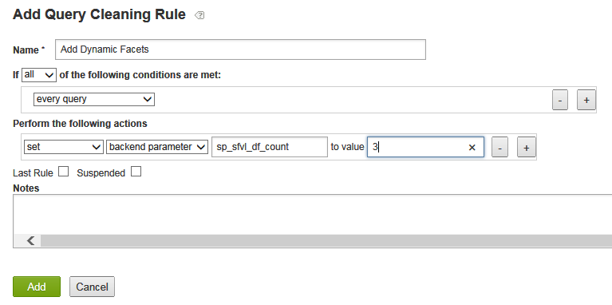

# 關於動態Facet{#about-dynamic-facets}

使用「動態刻面」，在搜尋時自動建立新的範圍選取。 您可以選擇將每個動態Facet欄位與Adobe Search&amp;Promote帳戶中最多一個表格名稱建立關聯。 您可在搜尋時，針對搜尋中涉及的任何動態Facet欄位套用這些表格關係。

## 使用動態Facet {#concept_E65A70C9C2E04804BF24FBE1B3CAD899}

>[!NOTE]
>
>預設情況下，此功能 [!DNL Adobe Search&Promote]未在中啟用。 請聯絡技術支援以啟用您使用的功能。

若不使用「動態刻面」，您必須將相關屬性合併為「槽」，並只顯示同構的槽，以用於特定搜尋。 也就是說，它們只能包含一個邏輯屬性的值，如「鞋尺寸」或「環尺寸」。 此方法以大量唯一屬性集提供適當的搜尋時間效能。

但是，當使用「動態Facet」時，並不會限制核心搜尋可有效追蹤的Facet數目。 您可以定義數百個動態刻面，核心搜尋可從中傳回特定搜尋的「頂級動態刻面」，其中 `N``N` 通常是10-20或更小的值。 此方法不需要插入屬性——您現在可以為網站上的屬性建立唯一的動態Facet。

## 您應將哪些方面設為動態？ {#section_254EE034BCAD4250A5D09FBF6158C4A5}

在您的網站上人煙稀少且只出現於搜尋子集的刻面，是產生動態的好候選。 例如，只有在搜尋鞋或靴時，才能填入名為「前腳寬度」的面。 而另一個名為「臉數字樣式」的刻面，其可能值為「羅馬」和「阿拉伯」，則只有在搜尋手錶或時鐘時才會出現。

如果您的帳戶有大量此類刻面，它會增強搜尋效能，以使用動態刻面，而不是永遠為每個搜尋選取整組可能刻面。 通常適用於顯示每個搜尋結果的一般刻面（例如「SKU」或「品牌」）通常不適用於動態刻面。

## 刻面與中繼標籤欄位的關係 {#section_2869E5FCDA8B431A87BC6E5573F2B0A0}

Facet建立在meta標籤欄位之上。 中繼標籤欄位是的低階核心搜尋層功能 [!DNL Adobe Search&Promote]。 另一方面，Facet則屬於GS（引導式搜尋）的一部分，即Adobe Search&amp;Promote的高階表現層。 但是，Facet擁有meta標籤欄位，meta標籤欄位對Facet一無所知。 設定動態Facet時，您會先新增Facet，然後新增中繼標籤欄位，並選取「動態Facet」選項，將識別的Facet設定為動態。

>[!NOTE]
>
>中沒有「動態Facet」設定 **[!UICONTROL Design > Navigation > Facets]**。 Facet之所以「動態」，是因為其基礎的「meta標籤欄位」是動態的，如中所設定 **[!UICONTROL Settings > Metadata > Definitions]**。

## 動態Facet的實際運作範例 {#section_BC699A05E2E742EF94D41679163ACE84}

在搜尋「啟動」後顯示的動態Facet範例：


搜尋「監看」後顯示的另一個動態Facet範例：


另請參閱

* [後端搜尋CGI參數](../c-appendices/c-cgiparameters.md#reference_582E85C3886740C98FE88CA9DF7918E8)
* [簡報範本標籤](../c-appendices/c-templates.md#reference_F1BBF616BCEC4AD7B2548ECD3CA74C64)
* [傳輸範本標籤](../c-appendices/c-templates.md#reference_227D199F5A7248049BE1D405C0584751)

## 設定動態Facet {#task_D17F484130E448258100BAC1EEC53F39}

在Search&amp;Promote中設定動態Facet。

<!-- 

t_configuring_dynamic_facets.xml

 -->

>[!NOTE]
>
>Adobe Search&amp;Promote預設未啟用此功能。 請聯絡技術支援以啟用您使用的功能。

在您的動態Facet效果對客戶可見之前，您必須重建網站索引。

另請參閱

* [後端搜尋CGI參數](../c-appendices/c-cgiparameters.md#reference_582E85C3886740C98FE88CA9DF7918E8)
* [簡報範本標籤](../c-appendices/c-templates.md#reference_F1BBF616BCEC4AD7B2548ECD3CA74C64)
* [傳輸範本標籤](../c-appendices/c-templates.md#reference_227D199F5A7248049BE1D405C0584751)

**若要設定動態Facet**

1. 請確定您已新增Facet。

   請參 [閱新增Facet](../c-about-design-menu/c-about-facets.md#task_FC07BFFA62CA4B718D6CBF4F2855C89B)。
1. 新增Facet後，請確定您已將Facet新增至新的使用者定義Meta標籤欄位。

   請參 [閱新增中繼標籤欄位](../c-about-settings-menu/c-about-metadata-menu.md#task_6DF188C0FC7F4831A4444CA9AFA615E5)。
1. 在產品功能表上，按一下 **[!UICONTROL Settings]** > **[!UICONTROL Metadata]** > **[!UICONTROL Definitions.]**
1. 在頁 [!DNL Definitions] 面上，在表格 [!DNL User-defined fields][!DNL Actions] 的欄中，按一下要動態化Facet的中繼標籤欄位名稱列中的鉛筆圖示（編輯）。
1. 在頁 [!DNL Edit Field] 面上，檢查 **[!UICONTROL Dynamic Facet]**。

   請參閱「新增中繼標籤」 [欄位中的選項表](../c-about-settings-menu/c-about-metadata-menu.md#task_6DF188C0FC7F4831A4444CA9AFA615E5)。
1. 按一下 **[!UICONTROL Save Changes]**.
1. 按一 **下藍色方塊中的重新產生分段網站索引** ，以快速重建分段網站索引。

   另請參 [閱重新產生即時或分段網站的索引](../c-about-index-menu/c-about-regenerate-index.md#task_B28DE40C0E9A475ABCBCBC4FF993AACD)。
1. 確定要為給定搜索選擇的動態刻面數。 通過執行下列任一操作，您可以完成此任務：

   * 建立含有任何所需條件的查詢清除規則 `set`，執行動作， `backend parameter`值，其中 `sp_sfvl_df_count` 是搜尋時要請求的所需動態刻面數目，然後按一下 `X``X`**[!UICONTROL Add]**。
   

   請參 [閱添加查詢清除規則](../c-about-rules-menu/c-about-query-cleaning-rules.md#task_47F43988D3D9485F8AE1DFDA7E00BF54)。

   另請參 [閱表格中的後端搜尋CGI參數](../c-appendices/c-cgiparameters.md#reference_582E85C3886740C98FE88CA9DF7918E8)，第40列，以取得進一步的說明 `sp_sfvl_df_count`。

   * 新增搜尋並將「自訂」參 `sp_sfvl_df_count` 數設為所需值，然後按一下 **[!UICONTROL Add]**。
   

   請參 [閱添加新搜索定義](../c-about-settings-menu/c-about-searching-menu.md#task_98D3A168AB5D4F30A1ADB6E0D48AB648)。

   另請參 [閱表格中的後端搜尋CGI參數](../c-appendices/c-cgiparameters.md#reference_582E85C3886740C98FE88CA9DF7918E8)，第40列，以取得進一步的說明 `sp_sfvl_df_count`。

1. 編輯適當的傳輸範本，以輸出核心搜尋傳回的動態Facet。

   請參 [閱編輯簡報或傳輸範本](../c-about-design-menu/c-about-templates.md#task_800E0E2265C34C028C92FEB5A1243EC3)。

   例如，假設您的傳輸範本是命名的 `guided.tpl`。 在這種情況下，請在產品功能表上按一下 **[!UICONTROL Design > Templates]**。 在頁面 [!DNL Templates] 上，找 `guided.tpl` 到表格。 然後按 **[!UICONTROL Edit]** 一下名稱的最右側。 在「編輯」頁面上，將下列程式碼區塊新增至結尾 `</facets>`:JSON輸出：

   ```
   ... 
   }<search-dynamic-facet-fields>, 
           { 
               "name" : "<search-dynamic-facet-field-name>", 
               "dynamic-facet" : 1, 
               "values" : [<search-field-value-list quotes="yes" commas="yes" data="values" sortby="values" encoding="json" />], 
               "counts" : [<search-field-value-list quotes="yes" commas="yes" data="results" sortby="values" />] 
   
           }</search-dynamic-facet-fields> 
   ...
   ```

1. 編輯適當的簡報範本或範本，以輸出動態刻面。

   請參 [閱編輯簡報或傳輸範本](../c-about-design-menu/c-about-templates.md#task_800E0E2265C34C028C92FEB5A1243EC3)。

   例如，假設您有一個名為的範本， `sim.tmpl` 用於在模擬器中輸出內容。 若要編輯該範本，請在產品選單上按一下 **[!UICONTROL Design > Templates]**。 在頁面 [!DNL Templates] 上，找 `sim.tmpl` 到表格。 然後按 **[!UICONTROL Edit]** 一下名稱的最右側。 在「編輯」頁面上，在範本的Facet顯示區域中新增下列項目：

   ```
   <h6>DF RAIL</h6> 
   <guided-facet-rail gsname="__dynamic_facets"> 
               <guided-facet ><!-- behavior=Normal --> 
               <div class="facet-block" id="facet"> 
               <p><b><guided-facet-display-name /></b></p> 
               <ul> 
                   <guided-facet-values> 
                       <guided-if-facet-value-equals-length-threshold> 
               </ul> 
               <ul id="brand" style="display:none"> 
                       </guided-if-facet-value-equals-length-threshold> 
                       <guided-if-facet-value-selected> 
                           <li><guided-facet-value> [<guided-lt>a href="<guided-facet-value-undo-path />"<guided-gt>X</a>]</li> 
                       <guided-else-facet-value-selected> 
                           <li><guided-facet-link><guided-facet-value></guided-facet-link> (<guided-facet-count>) </li> 
                       </guided-if-facet-value-selected> 
                   </guided-facet-values> 
               </ul> 
               <guided-if-facet-long> 
                 <br /><guided-lt />a href="#" onclick="moreless(this,'brand');return false;" <guided-gt /><button style="font-size:10px;">VIEW MORE</button></a> 
               </guided-if-facet-long> 
               </div> 
               </guided-facet> 
   </guided-facet-rail> 
   <h6>/DF RAIL</h6>
   ```

   您也可以視需要對其他簡報範本進行類似的修改，例如 `json.tmpl`。

   請務必在標 `__dynamic_facets` 記中 `gsname` 指定 `guided-facet-rail` 。 此標籤是預先定義的Facet邊欄，保留用於輸出為特定搜尋傳回的任何動態Facet。

   您也可以選擇透過「規則>業務規則」，並使用下方所示的「進階規則產生器」來編輯此特殊Facet邊欄。

   

   另請參閱 [添加新業務規則](../c-about-rules-menu/c-about-business-rules.md#task_BD3B31ED48BB4B1B8F1DCD3BFA2528E7)
