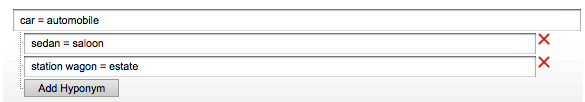

# 關於字典{#about-dictionaries}

您可以使用字典來管理字典的集合，以及其相關的同義字和同義字。

## 使用字典 {#concept_B8028B71EC8144669614C64578EDB034}

同義字是指具有相同或類似含義的字詞，例如褲子、牛仔褲、褲子和長褲，或購買、購買、購買和訂購。

同義字是單向同義詞，當同義字不合適時，可提供解決方案。 例如，服裝零售網站的首要搜尋詞是「pants」。 不過，牛仔褲不會出現在搜尋結果中。 在這種情況下，你可以用混搭詞把牛仔褲和褲子聯繫起來，但允許搜索牛仔褲只返回牛仔褲。 使用地名也能提供中止產品或競爭術語的比對。 此策略可確保對其他搜索結果的影響最小。 例如，如果&quot;S2000&quot;產品中止，而&quot;S3000&quot;是其後繼產品，請使用hyponym而不是同義詞以確保&quot;S3000&quot;的搜索結果不包含任何雜亂的&quot;S2000&quot;結果。

當客戶輸入網頁上不存在的非精確匹配詞時，同義詞和hyponums可協助他們尋找相關的搜尋結果。 例如，若您的網站中使用「pants」一詞，您可以建立將「pants」和「thaes」系結在一起的同義詞。 而當客戶搜尋「褲子」時，則會傳回與褲子相關的搜尋結果。

同義字和同義字會分組為網域字典。 這些是您為特定主題或目的所建立的特殊字典。

「字典菜單」頁列出了您的帳戶當前已定義的所有域字典。 在此首頁中，您可以重新命名、編輯、刪除或啟用和停用網域字典。

## 理解同義詞和同義符號 {#section_B459CCB850974F4FB16A14E489BBBEC0}

下圖是一組同時具有同義詞和同義詞關係的術語的示例。

明確定義了6種主要的同義詞關係。 每個詞語以等號(=)分隔。

* &quot;汽車&quot;是汽車的同義詞。
* &quot;轎車&quot;是轎車的同義詞。
* &quot;旅行車&quot;是房地產的同義詞。
* &quot;ASP&quot;是Active Server頁和應用程式服務提供商的同義詞。
* 「購買」、「購買」和「採購」是彼此的同義詞。
* &quot;U.S.&quot;、&quot;USA.&quot;和&quot;U.S......&quot;是彼此的同義詞。

包含單字的行是純同義字。 具有可展開樹的行形成混合關係。 在本例中，第二棵樹將轎車、轎車、貨車和房產定義為汽車和汽車的混合。 相反，汽車和汽車是樹中其他術語的超級詞。

第三棵樹把汽車和摩托車定義為汽車的假名。

您可以在每個同義詞中包含多個縮寫詞和／或多字詞展開，如上面的&quot;US&quot;同義詞示例所示。 當單字或縮寫詞有數個含義時，請為每個含義建立同義詞，如上面的「ASP」範例中所示。 通過添加多個同義字，您確保搜索「應用程式服務提供方」時不會返回「活動伺服器頁」的搜索結果。

地名不會隨著其他地名而膨脹。 同義詞的同義詞最多可以擴展到一個層次。 例如，搜索&quot;vehicle&quot;會返回&quot;car&quot;和&quot;automobile&quot;的結果，但不返回&quot;sedan&quot;和&quot;tastion wagon&quot;的結果。

## 關於跨字典搜尋詞 {#section_28E7F80CE68D4481BBF4F51EED237C67}

您可以在新增的所有字典中搜尋地名和同義字。 如果您想要編輯或刪除多個字典中可能存在的特定詞語，此功能就很有用。 每個具有匹配結果的字典都會顯示其匹配的字集。 如果查詢返回超過1000個集或樹，則只顯示前1000個。

請參閱 [跨字典搜尋](../c-about-linguistics-menu/c-about-dictionaries.md#task_8D2BACC6F9B4487FA82367CBEDEE306F)。

請參 [閱編輯字典](../c-about-linguistics-menu/c-about-dictionaries.md#task_7B349B2D385048D7A06E754FAB75316A)。

## 關於將字典配置為詞乾字典 {#section_B859E2E957674F558AC6F8D05A0ED190}

詞乾功能是指搜尋可以有多個結尾的字詞根的能力，它可以在三種模式之一運作：網域字典、預設替代字詞表單和無。

請參 [閱關於字詞和語言](../c-about-linguistics-menu/c-about-words-and-language.md#concept_CEB4B9576F3C4E2EB87B352EEC738D79)。

以下資訊假設您的帳戶已設 **[!UICONTROL Alternative Word Forms]** 定為 **[!UICONTROL Domain Dictionaries]**，以便您能將特定網域字典設定為系統來源。

您可以將任何網域字典轉換為「字詞字典」。 它的同義詞和假名繼續如預期般擴大，但有其他副作用。 如果其他字典中有任何共同的辭彙，甚至本身也有，它會將其一組單字與這些同義字或同義字合併。 你可以把它看作是另一個層面的文字擴張。

若沒有字串，同義詞和hyponums必須詳盡完整，並將每個相關單字列為成員。

以下是同義字和無相關字詞的範例：

* 同義字：角拐=跑步
* 查詢&quot;jog&quot;會產生單字為&quot;running&quot;和&quot;jog&quot;的檔案。
* 「執行」查詢會產生與「角拐」相同的檔案。
* 沒有&quot;jog&quot;和&quot;running&quot;但有&quot;runs&quot;和&quot;run&quot;等其他字詞表單的網頁在查詢結果中遺失。

在此示例中，除非查詢詞是特定同義詞或同義詞的成員，否則它不展開。

以下是同義字和詞乾的範例：

* 同義字：角拐=跑步
* 來自詞乾字典的同義詞條目：運行=運行=運行
* 查詢&quot;jog&quot;或&quot;running&quot;會傳回所有含有&quot;runs&quot;、&quot;running&quot;、&quot;run&quot;和&quot;jog&quot;的網頁。
* 查詢&quot;runs&quot;和&quot;run&quot;會傳回相同或類似的結果。

在此示例中，詞根字典的同義詞能夠將其同義片語與任何其他字典中至少有一個共同詞的同義詞或同義詞合併。

指定太多字詞的字典會產生效能影響。 您應謹慎地將網域字典指定為詞根字典。 詞乾功能還可在搜尋時產生意想不到的字詞擴充，並使除錯和追蹤字詞擴充的程式變得複雜。

請參 [閱將字典配置為詞乾字典](../c-about-linguistics-menu/c-about-dictionaries.md#task_541E8453A12F4A8E89CF6F595469F074)。

## Adding a new dictionary {#task_F31AC6723E894C4F91D12AB2A4CEE9FB}

您可以新增同義詞和同義字字典，以協助客戶找到相關的搜尋結果。 當客戶輸入您網頁上可能不存在的非精確符合詞語時，此功能特別有用。

另請參 [閱新增業務規則](../c-about-rules-menu/c-about-business-rules.md#task_BD3B31ED48BB4B1B8F1DCD3BFA2528E7)。

**若要新增字典**

1. 在產品功能表上，按一下 **[!UICONTROL Linguistics]** > **[!UICONTROL Dictionaries]**。
1. 在頁面上 **[!UICONTROL Dictionary Menu]** ，按一下 **[!UICONTROL Add New Dictionary]**。
1. 在頁 **[!UICONTROL Dictionary]** 面的欄位 **[!UICONTROL Name]** 中，輸入新字典的名稱。
1. 按一下 **[!UICONTROL Add Synonyms]**.
1. 在對話 **[!UICONTROL Add Terms]** 方塊中，執行下列其中一項作業：

   * 若要新增同義字，請在主文字欄位中輸入兩個或多個詞語，以等號(=)分隔每個單字或片語。 例如，褲子=褲子=寬鬆褲。
   * 若要新增hyponums，請在主文字欄位中輸入hypernym詞語。 單 **[!UICONTROL Add Hyponym]**&#x200B;擊，然後輸入與您輸入的超音節相關的混音。 例如，「轎車」、「轎車」、「貨車」和「房產」可以是「汽車」和「汽車」（兩者皆為超大型轎車）的混合名稱，如下所示。

      

      連字詞也可以形成「轎車」和「轎車」等同義詞。

1. 按一下 **[!UICONTROL Save]**.
1. 進行以下一項操作: 

   * 重複步驟4-6以新增更多同義字和同義字。
   * 繼續下一步。

1. 若要預覽變更結果，請按一下以 **[!UICONTROL regenerate your staged site index]** 重建分段網站索引。

   請 [參閱執行即時或分段網站的完整索引……](../c-about-index-menu/c-about-full-index.md#task_F7FE04D8A1654A7787FCCA31B45EB42D).

   請參 [閱執行即時或分段網站的遞增索引……](../c-about-index-menu/c-about-incremental-index.md#task_9BFB6157F3884B2FAECB7E0E9CA318CB).
1. （可選）在產品功能表上，按一 **[!UICONTROL Linguistics]** 下> **[!UICONTROL Dictionaries]**，然後執行下列其中一項作業：

   * 按一 **[!UICONTROL History]** 下以回復您所做的任何變更。

      請參 [閱使用歷史記錄選項](../t-using-the-history-option.md#task_70DD3F87A67242BBBD2CB27156F43002)。

   * 按一下 **[!UICONTROL Live]**.

      請參 [閱檢視即時設定](../c-about-staging.md#task_401A0EBDB5DB4D4CA933CBA7BECDC10F)。

   * 按一下 **[!UICONTROL Push Live]**.

      請參 [閱「即時推送舞台設定](../c-about-staging.md#task_44306783B4C0408AAA58B471DAF2D9A4)」。

## 啟用或禁用字典 {#task_EC282EA0846942F6913918EA8218220B}

每個字詞的關係是在您為網站建立索引時產生的。 在下次建立索引操作之前，您可以開啟或關閉已新增的任何字典。

**要啟用或禁用字典**

1. 在產品功能表上，按一下 **[!UICONTROL Linguistics]** > **[!UICONTROL Dictionaries]**。
1. 在頁 **[!UICONTROL Dictionary Menu]** 面上，在表的 **[!UICONTROL Enabled]** 列下，執行下列操作之一：

   * 選中要開啟並已編製索引的字典的框。
   * 取消選中要關閉且未編製索引的字典的框。

1. 按一下 **[!UICONTROL Save Changes]**.
1. 若要預覽變更結果，請按一下以 **[!UICONTROL regenerate your staged site index]** 重建分段網站索引。

   請 [參閱執行即時或分段網站的完整索引……](../c-about-index-menu/c-about-full-index.md#task_F7FE04D8A1654A7787FCCA31B45EB42D).

   請參 [閱執行即時或分段網站的遞增索引……](../c-about-index-menu/c-about-incremental-index.md#task_9BFB6157F3884B2FAECB7E0E9CA318CB).
1. （可選）在產品功能表上，按一 **[!UICONTROL Linguistics]** 下> **[!UICONTROL Dictionaries]**，然後執行下列其中一項作業：

   * 按一 **[!UICONTROL History]** 下以回復您所做的任何變更。

      請參 [閱使用歷史記錄選項](../t-using-the-history-option.md#task_70DD3F87A67242BBBD2CB27156F43002)。

   * 按一下 **[!UICONTROL Live]**.

      請參 [閱檢視即時設定](../c-about-staging.md#task_401A0EBDB5DB4D4CA933CBA7BECDC10F)。

   * 按一下 **[!UICONTROL Push Live]**.

      請參 [閱「即時推送舞台設定](../c-about-staging.md#task_44306783B4C0408AAA58B471DAF2D9A4)」。

## 編輯字典 {#task_7B349B2D385048D7A06E754FAB75316A}

您可以編輯或刪除組成特定字典的同義字和同義字組。

<!-- 

t_editing_a_dictionary.xml

 -->

您也可以使用來 **[!UICONTROL Find]** 找出您要在所有字典中編輯或刪除的特定同義字和異名。

**若要編輯字典**

1. 在產品功能表上，按一下 **[!UICONTROL Linguistics]** > **[!UICONTROL Dictionaries]**。
1. 進行以下一項操作: 

   * 在頁面 [!DNL Dictionary Menu] 的表格中，按一下您要編輯或刪除其詞語的單一字典的超連結名稱。
   * 在頁 [!DNL Dictionary Menu] 面的文字欄 **[!UICONTROL Find]** 位中，輸入您要在所有字典間找到的詞語，然後按一下 **[!UICONTROL Find]**。

      在頁面 [!DNL Find in Dictionaries] 上，使用隨附的下拉式清單來設定您想要的調整選項。

      <table> 
      <thead> 
        <tr> 
        <th colname="col1" class="entry"> 
選項 
 </th> 
        <th colname="col2" class="entry"> 
說明 
 </th> 
        </tr> 
      </thead>
      <tbody> 
        <tr> 
        <td colname="col1"> 
尋找 
 </td> 
        <td colname="col2"> 
可讓您輸入要在所有字典中搜尋的詞語。 
 </td> 
        </tr> 
        <tr> 
        <td colname="col1"> 
符合下拉式清單 
 </td> 
        <td colname="col2"> 
可讓您從下列四種類型的比對中選擇： 
        <ul id="ul_D656F159677946938050115F610EEF4B"> 
        <li id="li_2D6B302E021A4CE7A47F028812633EDC">  完全符合  
查詢必須與同義詞或同義詞完全匹配。 
 </li> 
        <li id="li_30AD5976E43041E98190F4757E821092">  包含文字  
查詢只需要子字串匹配；同義詞或同義詞中的匹配。 
 </li> 
        <li id="li_9BF911EFB54345BB82679BDE51DDF8AF">  開始於  
查詢僅與每個同義詞和同義詞的開頭匹配。 
 </li> 
        <li id="li_CB791C7F5B5A4496B329ED505E7D97BC">  字詞比對  
查詢與來自同義詞或同義詞的每個單字進行比較，但單字必須完全匹配。 
 </li> 
        </ul> 
 </td> 
        </tr> 
        <tr> 
        <td colname="col1"> 
啟用／停用字典下拉式清單 
 </td> 
        <td colname="col2"> 
可讓您從下列選項中選取： 
        <ul id="ul_EBBD3F3A2D854952A35CBDDBECB40958"> 
        <li id="li_7F5654C284BE485EAC9B000A663C6C60">  啟用和停用字典  
在啟用和停用的字典中搜尋指定的詞語。 
 </li> 
        <li id="li_4A83EECF38044287A923EC0AAF639079">  僅啟用字典  
僅搜索啟用的字典有助於調試當前索引。 
 </li> 
        </ul> 
 
請參 <a href="../c-about-linguistics-menu/c-about-dictionaries.md#task_EC282EA0846942F6913918EA8218220B" type="task" format="dita" scope="local"> 閱啟用或停用字典 </a>。 
 </td> 
        </tr> 
        <tr> 
        <td colname="col1"> 
「分段／即時」下拉式清單 
 </td> 
        <td colname="col2"> 
可讓您從下列選項中選取： 
        <ul id="ul_BD0733A30E6B470E942B21F499A4373B"> 
        <li id="li_F9A8C39C22EA4FBF86536F5924ED973C">  分段／即時字典  
在分段和即時字典中搜尋指定詞。 但是，它只搜索字典的分段版本（如果存在）。 如果分段版本不存在，則會搜尋字典的即時版本。 
 </li> 
        <li id="li_DB0944DB18564269AA10676BDFDB0460">  即時字典  
僅在即時字典中搜尋指定的詞語。 
 </li> 
        </ul> 
 </td> 
        </tr> 
      </tbody> 
      </table>

1. 在表格中，執行下列任一操作：

   * 按一  下與您要更新之詞語相關聯的詞語。 在對 **[!UICONTROL Edit Terms]** 話方塊中，變更您想要的詞語。 完成後，按一下 **[!UICONTROL Save]**。

   * 按一  下與您要移除之詞語相關聯的詞語。 在對話 **[!UICONTROL Delete Terms]** 方塊中，按一下 **[!UICONTROL Delete]**。 請務必刪除正確的詞語；沒有刪除確認對話框。

1. 若要預覽變更結果，請按一下以 **[!UICONTROL regenerate your staged site index]** 重建分段網站索引。

   請 [參閱執行即時或分段網站的完整索引……](../c-about-index-menu/c-about-full-index.md#task_F7FE04D8A1654A7787FCCA31B45EB42D).

   請參 [閱執行即時或分段網站的遞增索引……](../c-about-index-menu/c-about-incremental-index.md#task_9BFB6157F3884B2FAECB7E0E9CA318CB).
1. （可選）在產品功能表上，按一 **[!UICONTROL Linguistics]** 下> **[!UICONTROL Dictionaries]**，然後執行下列其中一項作業：

   * 按一 **[!UICONTROL History]** 下以回復您所做的任何變更。

      請參 [閱使用歷史記錄選項](../t-using-the-history-option.md#task_70DD3F87A67242BBBD2CB27156F43002)。

   * 按一下 **[!UICONTROL Live]**.

      請參 [閱檢視即時設定](../c-about-staging.md#task_401A0EBDB5DB4D4CA933CBA7BECDC10F)。

   * 按一下 **[!UICONTROL Push Live]**.

      請參 [閱「即時推送舞台設定](../c-about-staging.md#task_44306783B4C0408AAA58B471DAF2D9A4)」。

## 重新命名字典 {#task_7F1F372B337B4853BFA2A60AD267B092}

您可以變更已新增之字典的名稱。

<!-- 

t_renaming_a_dictionary.xml

 -->

如果您將選 **[!UICONTROL Alternate Word Forms]** 項設 **[!UICONTROL Domain Dictionaries]** 為 **[!UICONTROL Words & Language]** in，則會 **[!UICONTROL Configure]** 使用選項而非 **[!UICONTROL Rename]**。

請參 [閱關於字詞和語言](../c-about-linguistics-menu/c-about-words-and-language.md#concept_CEB4B9576F3C4E2EB87B352EEC738D79)。

**要更名字典**

1. 在產品功能表上，按一下 **[!UICONTROL Linguistics]** > **[!UICONTROL Dictionaries]**。
1. 在頁 **[!UICONTROL Dictionary Menu]** 面上，在表的 **[!UICONTROL Actions]** 列下，執行下列操作之一：

   * 按一 **[!UICONTROL Rename]** 下您要變更其名稱的相關字典。

      對話框 **[!UICONTROL Rename Dictionary]** 中。 在字 **[!UICONTROL Name]** 段中，輸入字典的新名稱。

      按一下 **[!UICONTROL Rename File]**.

   * 按一 **[!UICONTROL Configure]** 下您要變更其名稱的相關字典。

      對話框 **[!UICONTROL Configure Dictionary]** 中。 在字 **[!UICONTROL Name]** 段中，輸入字典的新名稱。

      按一下 **[!UICONTROL Save Configuration]**.

1. （可選）執行下列任一項作業：

   * 按一 **[!UICONTROL History]** 下以回復您所做的任何變更。

      請參 [閱使用歷史記錄選項](../t-using-the-history-option.md#task_70DD3F87A67242BBBD2CB27156F43002)。

   * 按一下 **[!UICONTROL Live]**.

      請參 [閱檢視即時設定](../c-about-staging.md#task_401A0EBDB5DB4D4CA933CBA7BECDC10F)。

   * 按一下 **[!UICONTROL Push Live]**.

      請參 [閱「即時推送舞台設定](../c-about-staging.md#task_44306783B4C0408AAA58B471DAF2D9A4)」。

## 將字典配置為詞乾字典 {#task_541E8453A12F4A8E89CF6F595469F074}

您可以將字典設為進階的字詞干擾模式，以利用搜尋中的字詞干擾。

<!-- 

t_configuring_a_dictionary_as_a_stemming_dictionary.xml

 -->

這種模式會傳回符合客戶搜尋內容的變體的網頁。

請參閱 [關於字典](../c-about-linguistics-menu/c-about-dictionaries.md#concept_B8028B71EC8144669614C64578EDB034)。

請參 [閱關於字詞和語言](../c-about-linguistics-menu/c-about-words-and-language.md#concept_CEB4B9576F3C4E2EB87B352EEC738D79)。

**將字典配置為詞乾字典**

1. 在產品功能表上，按一下 **[!UICONTROL Linguistics]** > **[!UICONTROL Words & Language]**。
1. 在頁 [!DNL Words & Languages] 面上，從下拉 **[!UICONTROL Alternate Words Forms]** 式清單中選擇 **[!UICONTROL Domain Dictionaries]**。

   任何設為詞乾字典的網域字典（請參閱下方步驟7）都會用作替代字詞表單的來源。

1. 按一下 **[!UICONTROL Save Changes]**.
1. 在產品功能表上，按一下 **[!UICONTROL Linguistics]** > **[!UICONTROL Dictionaries]**。
1. 在頁 [!DNL Dictionaries Menu] 面上，在表格的 **[!UICONTROL Actions]** 欄下，按一下您要設 **[!UICONTROL Configure]** 定為相關字詞字典的相關字典。
1. 在對 **[!UICONTROL Configure Dictionary]** 話方塊的下拉式清 **[!UICONTROL Advanced Stemming Mode]** 單中，選取 **[!UICONTROL Yes]**。
1. 按一下 **[!UICONTROL Save Configuration]**.
1. 按一 **[!UICONTROL regenerate your staged site index]** 下以重建分段網站索引。

   請 [參閱執行即時或分段網站的完整索引……](../c-about-index-menu/c-about-full-index.md#task_F7FE04D8A1654A7787FCCA31B45EB42D).

   請參 [閱執行即時或分段網站的遞增索引……](../c-about-index-menu/c-about-incremental-index.md#task_9BFB6157F3884B2FAECB7E0E9CA318CB).
1. （可選）在產品功能表上，按一 **[!UICONTROL Linguistics]** 下> **[!UICONTROL Dictionaries]**，然後執行下列其中一項作業：

   * 按一 **[!UICONTROL History]** 下以回復您所做的任何變更。

      請參 [閱使用歷史記錄選項](../t-using-the-history-option.md#task_70DD3F87A67242BBBD2CB27156F43002)。

   * 按一下 **[!UICONTROL Live]**.

      請參 [閱檢視即時設定](../c-about-staging.md#task_401A0EBDB5DB4D4CA933CBA7BECDC10F)。

   * 按一下 **[!UICONTROL Push Live]**.

      請參 [閱「即時推送舞台設定](../c-about-staging.md#task_44306783B4C0408AAA58B471DAF2D9A4)」。

## 跨字典搜尋 {#task_8D2BACC6F9B4487FA82367CBEDEE306F}

您可以在所有新增至網站搜尋／銷售的字典中搜尋地名和同義字。

<!-- 

t_searching_across_dictionaries.xml

 -->

如果您想要編輯或刪除多個字典中可能存在的特定詞語，此功能就很有用。 每個具有匹配結果的字典都會顯示其匹配的字集。 如果查詢返回超過1000個集或樹，則只顯示前1000個。

請參 [閱編輯字典](../c-about-linguistics-menu/c-about-dictionaries.md#task_7B349B2D385048D7A06E754FAB75316A)。

**若要跨字典搜尋**

1. 在產品功能表上，按一下 **[!UICONTROL Linguistics]** > **[!UICONTROL Dictionaries]**。
1. 在頁 [!DNL Dictionary Menu] 面的文字欄 **[!UICONTROL Find]** 位中，輸入您要在所有字典間找到的詞語，然後按一下 **[!UICONTROL Find]**。
1. 在頁面 [!DNL Find in Dictionaries] 上，使用隨附的下拉式清單來設定您想要的任何調整選項。

   請參 [閱編輯字典](../c-about-linguistics-menu/c-about-dictionaries.md#task_7B349B2D385048D7A06E754FAB75316A)。
1. （可選）使 **[!UICONTROL Show]** 用下拉式清單指定每個頁面要顯示的結果數目上限。

## 刪除字典 {#task_DBAAEE624BC14D2590444B0B7869ECCA}

您可以刪除不再需要或使用的字典。

<!-- 

t_deleting_a_dictionary.xml

 -->

如果您刪除即時的字典，則會暫存以刪除。 如果刪除已存放的字典，該字典會立即刪除。

請確定您正在刪除您知道更需要的字典；沒有歷史記錄功能可用來還原刪除。

**刪除字典**

1. 在產品功能表上，按一下 **[!UICONTROL Linguistics]** > **[!UICONTROL Dictionaries]**。
1. 在頁 [!DNL Dictionary Menu] 面上，在表格的 **[!UICONTROL Actions]** 欄下，按一下您要 **[!UICONTROL Delete]** 移除的相關字典。
1. 對話框 **[!UICONTROL Delete Dictionary]** 中。 click **[!UICONTROL Yes]** to confirm the deletion.
1. （選擇性）如果您刪除了即時字典，請執行下列其中一項作業：

   * 按一下 **[!UICONTROL Live]**.

      請參 [閱檢視即時設定](../c-about-staging.md#task_401A0EBDB5DB4D4CA933CBA7BECDC10F)。

   * 按一下 **[!UICONTROL Push Live]**.

      請參 [閱「即時推送舞台設定](../c-about-staging.md#task_44306783B4C0408AAA58B471DAF2D9A4)」。

