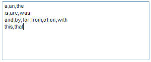

# 關於排除的字詞{#about-excluded-words}

您可以使用「排除的字詞」來指定您要排除在搜尋結果外的常用片語和常用字詞，例如&quot;a&quot;和&quot;the&quot;。

## 使用排除的字詞 {#concept_9DB67BD2F0DC43AC88741003D9F39812}

See also [About Searches](../c-about-settings-menu/c-about-searching-menu.md#concept_207105CF26B1448F8A3D223787C56AB8).

沒有排除的字詞，包含這些字詞的搜尋可能會識別許多不相關的結果。 排除字詞和片語時，會忽略僅符合您所指定之已排除詞語的搜尋結果。 如果搜索查詢包含已排除的單詞，則僅使用非排除的單詞查找文檔。

排除的搜尋字詞不會在搜尋結果中反白顯示。 但是，每個結果的相關性分數會受到排除字詞的影響。 換言之，在尋找檔案時會忽略排除的字詞，但在搜尋結果頁面上對檔案進行排名時仍會使用這些字詞。 在「排除的字詞」設定（或對這些設定所做的變更）的效果可供客戶使用之前，請務必重新產生網站索引。

當您輸入要從搜尋結果中排除的字詞時，會以逗號將字詞或片語彼此分隔。 您可以輸入一行或多行排除字詞。 以下是分隔行上以逗號分隔的排除字詞範例。

使用上述排除字詞的範例清單，若您的客戶搜尋「美國」，則搜尋中會排除「the」和「of」字詞。 相反，搜尋會尋找包含&quot;united&quot;、&quot;states&quot;和&quot;america&quot;的所有頁面。 僅包含&quot;of&quot;或&quot;the&quot;的頁面不會顯示。

有些網站在大部分或全部頁面上都包含特定片語。 例如，紐約市的旅遊網站在每個頁面的標題中都可以包含「紐約」一詞。 請考慮將此片語和其他類似的片語新增至排除清單：

排除片語時，組成片語的個別字詞仍會當做搜尋詞使用。 只有當訪客以排除的片語的確切順序搜尋確切字詞時，才會將片語排除在搜尋結果之外。 使用上述範例，如果客戶搜尋「紐約芭蕾」，則排除「the」和片語「new york」;只有包含&quot;ballet&quot;的頁面才會作為搜尋結果傳回。 另一方面，搜尋「新建築」或「約克公爵」仍會分別找到包含「new」或「york」的頁面。

## 設定排除的字詞 {#task_60BF6BB7A66C48479D2BBB32C0F38CDE}

您可以從搜尋結果中排除常用的片語和常用字詞。

您可以每行輸入一或多個字詞。 使用逗號分隔每個單字，如下例所示：

您可以選擇在客戶搜尋中的所有字詞皆被排除時顯示搜尋結果。 例如，如果您已排除單字&quot;the&quot;，而客戶選擇只搜尋&quot;the&quot;，則搜尋結果會顯示任何包含單字&quot;the&quot;的頁面。 即使排除&quot;the&quot;一詞，這個結果仍然成立。 如果您未勾選此選項，客戶將無法獲得任何搜尋結果。 如果搜尋包含至少一個非排除的字詞，則此設定不會生效。

**若要設定排除的字詞**

1. 在產品功能表上，按一下 **[!UICONTROL Linguistics]** > **[!UICONTROL Excluded Words]**。
1. 在頁 [!DNL Excluded Words] 面的文字欄 **[!UICONTROL Words and Phrases]** 位中，輸入要從搜尋結果中排除的字詞。
1. （可選）按一下 **[!UICONTROL Show results when all words in the query are excluded words]**。

   當客戶搜尋中的所有字詞皆排除在外時，所有字詞都會一起使用以執行搜尋。
1. 按一下 **[!UICONTROL Save Changes]**.
1. 若要預覽變更結果，請按一下以 **[!UICONTROL regenerate your staged site index]** 重建分段網站索引。

   請 [參閱執行即時或分段網站的完整索引……](../c-about-index-menu/c-about-full-index.md#task_F7FE04D8A1654A7787FCCA31B45EB42D).

   請參 [閱執行即時或分段網站的遞增索引……](../c-about-index-menu/c-about-incremental-index.md#task_9BFB6157F3884B2FAECB7E0E9CA318CB).
1. （可選）在產品功能表上，按一 **[!UICONTROL Linguistics]** 下> **[!UICONTROL Excluded Words]**，然後執行下列其中一項作業：

   * 按一 **[!UICONTROL History]** 下以回復您所做的任何變更。

      請參 [閱使用歷史記錄選項](../t-using-the-history-option.md#task_70DD3F87A67242BBBD2CB27156F43002)。

   * 按一下 **[!UICONTROL Live]**.

      請參 [閱檢視即時設定](../c-about-staging.md#task_401A0EBDB5DB4D4CA933CBA7BECDC10F)。

   * 按一下 **[!UICONTROL Push Live]**.

      請參 [閱「即時推送舞台設定](../c-about-staging.md#task_44306783B4C0408AAA58B471DAF2D9A4)」。

