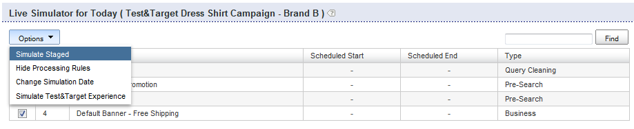

# 關於業務規則{#about-business-rules}

您可以使用「業務規則」來商品化您的搜尋。

## 使用業務規則 {#concept_2A93D76216754D3D8412CDEA00BD26BD}

例如，您可以設定橫幅的出現時間、結果的顯示順序。 您也可以設定Facet中項目的位置，以及指定搜尋使用的範本。 這些規則按照定義的順序運行；規則的訂單編號越高，在流程中執行的時間越晚，超過了先前的規則。 您可以拖放規則來變更其順序，或在規則順序文字方塊中輸入新數字以重新排序。

每個業務規則都由觸發器和操作組成。

觸發器定義規則執行時間。 例如，當查詢詞語為&quot;mens&quot;或結果大多為帽子時。 觸發器由多個條件組成，這些條件必須全部為，或者其中任何條件為true，才能使整個觸發器為true。 您可以變更觸發運算子來指定優先順序。

動作會定義當觸發條件符合時會發生什麼。 例如，將橫幅設為顯示或將指定結果移至位置1。 規則表格顯示規則的摘要資訊。 您可以按一下規則名稱以開啟它，並查看其他資訊。

規則表顯示所有業務規則的清單。 依預設，表格會以遞減順序顯示最近新增的十個規則。 您可以按一下表格中的欄標題，以遞增或遞減順序排序規則。

業務規則可以有三種狀態之一：批准、暫停或WIP（在製品）

<table> 
 <thead> 
  <tr> 
   <th colname="col1" class="entry"> 
業務規則狀態 
 </th> 
   <th colname="col2" class="entry"> 
說明 
 </th> 
  </tr> 
 </thead>
 <tbody> 
  <tr> 
   <td colname="col1"> 
已核准 
 </td> 
   <td colname="col2"> 
已核准的業務規則會在您的即時環境和分段環境中執行。 您可以在「進階規則產生器」中核准業務規則。 
 </td> 
  </tr> 
  <tr> 
   <td colname="col1"> 
暫停 
 </td> 
   <td colname="col2"> 
暫停的業務規則不會在您的分段環境或即時環境中執行。 
 </td> 
  </tr> 
  <tr> 
   <td colname="col1"> 
WIP 
 </td> 
   <td colname="col2"> 
WIP（在製品）是未批准或暫停的業務規則。 也就是說，您可能仍在處理這些軟體，或是先進行測試再核准。 處於WIP狀態的業務規則僅在提貨環境中運行。 
 </td> 
  </tr> 
 </tbody> 
</table>

您核准業務規則並將其推送至即時，以便在您的即時環境中執行。 目前，您只能將所有規 *則推* 送至現場。 不過，您可以變更規則的狀態，以控制在您的即時環境中執行和不執行的規則。

依預設，規則會在符合其相關觸發程式時執行。 不過，您可以選擇性地排程規則，以針對特定日期和時間範圍執行。

此外，依預設，規則會在所有商店符合其關聯觸發器時執行。 如果您希望規則僅適用於某些商店，則可使用「商店」面板來選取規則套用至的一或多個商店。

## 新增業務規則 {#task_BD3B31ED48BB4B1B8F1DCD3BFA2528E7}

您可以使用 [!DNL Visual Rule Builder] 或新 [!DNL Advanced Rule Builder] 增可量身打造客戶搜尋體驗的業務規則。

**若要新增業務規則**

下列步驟假設您使用「視覺化規則產生器」。

1. 進行以下一項操作: 

   * 在產品功能表上，按一下 **[!UICONTROL Rules]** > **[!UICONTROL Business Rules]**。 在頁面上 [!DNL Business Rules] ，按一下 **[!UICONTROL Add New Rule]**。

   * 在產品選單上，按一下 **[!UICONTROL Simulator]**。 在頁 **[!UICONTROL Simulator for Today]** 面上，按 **[!UICONTROL Add New Rule]** 一下下拉式功 **[!UICONTROL Options]** 能表右側。

      如果 **[!UICONTROL Add New Rule]** 頁面上未顯示選項，請在下拉式功 **[!UICONTROL Options]** 能表中按一下 **[!UICONTROL Simulate Staged]**。

      

1. 在文字 **[!UICONTROL Name]** 欄位中，輸入業務規則的新名稱。

   請勿按 **[!UICONTROL Save Rule]** 一下。
1. （可選）如果您管理大量業務規則，則可以使用特定標籤來標籤業務規則。 在欄位 **[!UICONTROL Tags]** 中，輸入一或多個標籤標籤，使用逗號、標籤或輸入作為分隔字元。

   在頁面 [!DNL Business Rules] 上，使用功 **[!UICONTROL Filter by tag]** 能來篩選符合指定標籤的規則。 1.在頁面 [!DNL Business Rule Builder] 上，設定您要使用的觸發器和動作。

   **觸發器選項**

   觸發器是業務規則必須符合的條件。 當業務規則具有多個觸發器時，您可以使用下列三種方法之一來配置觸發器的響應方式：

   * 所有觸發器都必須為true（預設設定）的回應，如下列範例所示：

      `if a AND b AND c then ...`

   * 任何觸發器都必須如下例所示的回應：

      `if a OR b OR c then ...`

   * 指定觸發器自訂組合的回應。 也就是說，您會將個別觸發器或「條件」與運算子 `AND` 和運算子 `OR` 結合。

      您也可以依下列範例新增左括弧和右括弧組合，以變更評估優先順序：

      `if (a OR b) AND c then ...`

      >[!NOTE]
      >
      >如果您在自訂 `AND` 業務規 `OR` 則集中結合運算子和運算子，請確定您已適當指定括弧，以確保以正確順序評估觸發器。

      預設情況下，無法啟用自定義觸發器組合的這一特定功能。 請聯絡技術支援以啟用此功能供您使用。
   <table> 
      <thead> 
      <tr> 
      <th colname="col1" class="entry"> 
觸發器選項 
 </th> 
      <th colname="col2" class="entry"> 
說明 
 </th> 
      </tr> 
    </thead>
    <tbody> 
      <tr> 
      <td colname="col1"> 
關鍵字元合 
 </td> 
      <td colname="col2"> 
當搜尋詞符合指定區分大小寫的關鍵字時，觸發器為true。 如「語言學字典」中所定義，關鍵字及其所有同義字的觸發皆為true。 
 </td> 
      </tr> 
      <tr> 
      <td colname="col1"> 
 查詢匹配項 
 </td> 
      <td colname="col2"> 
 當所有搜尋參數相符時，觸發器為true。 
 </td> 
      </tr> 
      <tr> 
      <td colname="col1"> 
 結果群佔優勢 
 </td> 
      <td colname="col2"> 
 當由給定搜索定義的結果組主導結果集時，觸發器為true。 
 
根據預設，主導權被設定在50%。 此設定是您可設定的銷售偏好設定。 
 
 
        <!--See <xref href="t_Configuring_Merchandising_preferences.xml#task_7AC7B9F5D9F44E10AB5BC0B8CB31C37A" type="task" format="dita" scope="local">Configuring Merchandising preferences</xref>. --> 
 
整個組必須存在於結果集中，此觸發器才為true。 結果群組是動態的。 索引操作之後，它們可以更改，具體取決於哪些結果符合原始搜索標準。 
 </td> 
      </tr> 
      <tr> 
      <td colname="col1"> 
結果組存在 
 </td> 
      <td colname="col2"> 
 當由給定搜索定義的結果組出現在結果集中時，觸發器為true。 要滿足此觸發器，必須在結果集中顯示整個組（結果可以出現在任何頁面上）。 結果組是動態的，在索引操作之後可能會根據與原始搜索標準匹配的結果而改變。 
 </td> 
      </tr> 
      <tr> 
      <td colname="col1"> 
 結果呈現 
 </td> 
      <td colname="col2"> 
 在結果集中找到單個結果時，觸發器為true。 結果可以位於結果集的任何位置，它不必位於用戶當前查看的頁面上。 
 </td> 
      </tr> 
    </tbody> 
    </table>

   **動作選項**

   當符合業務規則的觸發器時，會執行與規則關聯的動作。 雖然「視覺化規則產生器」可讓您建立下列動作，但您可以使用「進階規則產生器」來建立其他類型的動作。

   下表中的「移除Facet項目」(Remove Facet Item)、「顯示Facet項目」(Reveal Facet)、「移除Facet」(Remove Facet)、「推送Facet項目」(Push Facet Item)操作需要Facet。 選擇Facet的介面取決於帳戶的設定方式。 例如，一般帳戶會使用下拉式清單來選擇Facet。 不過，如果您的帳戶有槽狀刻面，則會出現自動完成文字方塊，您可在其中輸入任何刻面的名稱。 當您輸入Facet名稱時，自動完成會在下拉式清單中建議Facet。 建議包括目前定義的刻面。 如果您的帳戶有槽點陣圖，也建議使用槽位面。

   <table> 
    <thead> 
      <tr> 
      <th colname="col1" class="entry"> 
動作選項 
 </th> 
      <th colname="col2" class="entry"> 
說明 
 </th> 
      </tr> 
    </thead>
    <tbody> 
      <tr> 
      <td colname="col1"> 
推送群組 
 </td> 
      <td colname="col2"> 
 將指定搜尋准則定義的搜尋結果群組推送至特定位置。 
 
推送搜尋結果群組並不會隱含新增群組。 
 </td> 
      </tr> 
      <tr> 
      <td colname="col1"> 
新增群組 
 </td> 
      <td colname="col2"> 
 根據指定的搜索標準定義添加搜索結果組。 
 </td> 
      </tr> 
      <tr> 
      <td colname="col1"> 
移除群組 
 </td> 
      <td colname="col2"> 
 刪除由指定搜索標準定義的搜索結果組。 
 </td> 
      </tr> 
      <tr> 
      <td colname="col1"> 
推送單一 
 </td> 
      <td colname="col2"> 
 將個別搜尋結果推送至選取的位置。 
 </td> 
      </tr> 
      <tr> 
      <td colname="col1"> 
新增單一 
 </td> 
      <td colname="col2"> 
 將個別搜尋結果新增至選取的位置。 
 </td> 
      </tr> 
      <tr> 
      <td colname="col1"> 
移除單一 
 </td> 
      <td colname="col2"> 
 從搜索結果集中刪除單個搜索結果。 
 </td> 
      </tr> 
      <tr> 
      <td colname="col1"> 
移除所有結果 
 </td> 
      <td colname="col2"> 
從搜索結果集中刪除所有結果。 
 
 
        <!-- Bug #3331637 The option is meant to be used in conjunction with other rule actions in order to create "canned landing pages" where we want to create a page's content solely by rule actions, and need to completely discard the "natural" results of the search. Given that the other options don't have any kind of "here's how/why you might use this", I don't see much point in breaking that precedent here.--> 
 </td> 
      </tr> 
      <tr> 
      <td colname="col1"> 
選取不同的橫幅 
 </td> 
      <td colname="col2"> 
 變更選取橫幅區域中的橫幅。 
 
當您在網頁檢視區中以滑鼠右鍵按一下橫幅時，就可使用此選項。 
 </td> 
      </tr> 
      <tr> 
      <td colname="col1"> 
新增橫幅命令 
 </td> 
      <td colname="col2"> 
僅適用於Adobe Dynamic Media Classic範本。 
 
可讓您變更橫幅範本中使用的預設參數。 
 
請參閱「使用Adobe Dynamic Media Classic <a scope="local" href="../c-about-design-menu/c-about-banners.md#task_AD1E0C00A9E04B1FA819EB93288786B3" type="reference" format="dita"> 新增橫幅」中的選項表 </a>。 
 
另請參 <a href="../c-about-design-menu/c-about-banners.md#task_C3E782477FBF428ABEA220751781ACA9" type="task" format="dita" scope="local"> 閱「使用Adobe Dynamic Media Classic編輯橫幅」 </a>。 
 </td> 
      </tr> 
      <tr> 
      <td colname="col1"> 
移除橫幅 
 </td> 
      <td colname="col2"> 
 從選取的橫幅區域移除橫幅；除非有設定橫幅的其他規則，否則不會顯示橫幅，而覆寫此規則。 
 
當您在網頁檢視區中以滑鼠右鍵按一下橫幅時，就可使用此選項。 
 </td> 
      </tr> 
      <tr> 
      <td colname="col1"> 
推播Facet項目 
 </td> 
      <td colname="col2"> 
 將Facet中的項目推入選取的位置。 
 </td> 
      </tr> 
      <tr> 
      <td colname="col1"> 
刪除區域 
 </td> 
      <td colname="col2"> 
 從搜索結果頁中刪除區域。 
 
另請參閱下方的「移除Facet」動作。 
 </td> 
      </tr> 
      <tr> 
      <td colname="col1"> 
顯示區域 
 </td> 
      <td colname="col2"> 
 在搜尋結果頁面中顯示區域。 
 
另請參閱下方的「顯現面」(Reveal Facet)動作。 
 </td> 
      </tr> 
      <tr> 
      <td colname="col1"> 
移除Facet項目 
 </td> 
      <td colname="col2"> 
 從Facet移除Facet項目。 
 </td> 
      </tr> 
      <tr> 
      <td colname="col1"> 
「顯示 Facet 項目」(Reveal Facet Item)  
 </td> 
      <td colname="col2"> 
 揭示特定Facet項目。 
 </td> 
      </tr> 
      <tr> 
      <td colname="col1"> 
顯示Facet 
 </td> 
      <td colname="col2"> 
 揭示特定Facet。 與「顯示區域」(Reveal Zone)操作相比，此操作更為首選。 
 </td> 
      </tr> 
      <tr> 
      <td colname="col1"> 
移除Facet 
 </td> 
      <td colname="col2"> 
 移除特定Facet。 與「刪除區域」(Remove Zone)操作相比，此操作更為首選。 
 </td> 
      </tr> 
    </tbody> 
    </table>

   根據規則產生器面板的作用中（展開），您也可以執行下列動作來設定觸發器和動作。

   * 展開面 **[!UICONTROL Triggers]** 板時——在「業務規則產生器」頁面的簡報範本區域中，以滑鼠右鍵按一下任何搜尋結果或搜尋Facet，然後按一下 **[!UICONTROL Add "result present" trigger]**。

      在「觸發器」面板中，按一下觸發器左側的「X」，將其從觸發器清單中移除。

   * 展開面 **[!UICONTROL Actions]** 板時——在「業務規則產生器」頁面的呈現範本區域，以滑鼠右鍵按一下搜尋結果。 按一 **[!UICONTROL Add Result]**&#x200B;下、 **[!UICONTROL Remove Result]**、或 **[!UICONTROL Push to bottom]**(其中 **[!UICONTROL Push to #`<n>`]**`<n>` 是數字)。

1. （可選）在任何「業務規則產生器」面 [!DNL Triggers]板( [!DNL Actions]、 [!DNL Schedule]或)中，執行下列任一項作業：

   * 在「業務規則產生器」頁面區域的簡報範本區域中，以滑鼠右鍵按一下橫幅，然後按一下 **[!UICONTROL Select different banner]**。 在頁面 **[!UICONTROL Pick Banner]** 上，按一 **[!UICONTROL Pick this banner]** 下橫幅縮圖下方，將其新增至簡報範本。 只有符合簡報範本上原始橫幅大小和區域的橫幅可供您選擇。

      新增橫幅動作會新增至面 [!DNL Actions] 板。

   * 在頁面的簡報範本區 [!DNL Business Rule Builder] 域中，以滑鼠右鍵按一下您要變更其參數的Adobe Dynamic Media Classic範本橫幅，然後按一下 **[!UICONTROL Add banner commands]**。 在對話 [!DNL Change Parameters] 方塊中，設定您要的參數選項。

      請參閱「使用Adobe Dynamic Media Classic [新增橫幅」中的選項表](../c-about-design-menu/c-about-banners.md#task_AD1E0C00A9E04B1FA819EB93288786B3)。

      按一下 **[!UICONTROL Save]**.

      參數變更會新增至面 [!DNL Actions] 板。

      另請參 [閱「使用Adobe Dynamic Media Classic編輯橫幅」](../c-about-design-menu/c-about-banners.md#task_C3E782477FBF428ABEA220751781ACA9)。

   * 在「業務規則產生器」頁面的簡報範本區域中，以滑鼠右鍵按一下您要從頁面刪除的橫幅，然後按一下 **[!UICONTROL Remove banner]**。 移除橫幅動作會新增至「動作」面板。

1. （可選）在面 **[!UICONTROL Schedule]** 板中，執行下列任一項作業：

   * 按一 **[!UICONTROL Run Indefinitely]** 下，每當符合規則的相關觸發器時，都可執行規則。 此選項為預設值。
   * 按一 **[!UICONTROL Fixed Schedule]**&#x200B;下，然後指定規則的開始日期和時間，以及在符合其相關觸發器時執行的結束日期和時間。

1. 按一下 **[!UICONTROL Save Rule]**.
1. （可選）在頁 [!DNL Business Rules] 面上，執行下列其中一項作業：

   * 按一 **[!UICONTROL History]** 下以回復您所做的任何變更。

      請參 [閱使用歷史記錄選項](../t-using-the-history-option.md#task_70DD3F87A67242BBBD2CB27156F43002)。

   * 按一下 **[!UICONTROL Live]**.

      請參 [閱檢視即時設定](../c-about-staging.md#task_401A0EBDB5DB4D4CA933CBA7BECDC10F)。

   * 按一下 **[!UICONTROL Push Live]**.

      請參 [閱「即時推送舞台設定](../c-about-staging.md#task_44306783B4C0408AAA58B471DAF2D9A4)」。

## 編輯業務規則 {#task_375CFA75D1D94D9E92A35DE1228E5087}

您可以使用「視覺化規則產生器」或「進階規則產生器」來編輯已新增的業務規則。

**要編輯新業務規則**

1. 在產品功能表上，按一下 **[!UICONTROL Rules]** > **[!UICONTROL Business Rules]**。
1. 在頁面 [!DNL Business Rules] 上，執行下列其中一項作業：

   * 在欄下 [!DNL Name] ，按一下您要變更之業務規則的名稱。

      業務規則會在「 > >」中指定的預設介面 **[!UICONTROL Settings]** 中 **[!UICONTROL My Profile]** 開啟 **[!UICONTROL My Preferences]**。

   * 在下拉式清單中，按一下或，在您要編輯的業務規則名稱旁 **[!UICONTROL Edit in advanced mode]** 邊 **[!UICONTROL Edit in visual mode]**。

1. 在文字 [!DNL Name] 欄位中，輸入業務規則的新名稱。

   請勿按 **[!UICONTROL Save Rule]** 一下。 1.在頁面 [!DNL Business Rule Builder] 上，設定您要使用的觸發器和動作。

   請參閱「新增業務規 [則」下的選項表](../c-about-rules-menu/c-about-business-rules.md#task_BD3B31ED48BB4B1B8F1DCD3BFA2528E7)。
1. （選用）在任 **[!UICONTROL Business Rule Builder]** 何面板( [!DNL Triggers]、 [!DNL Actions]或 [!DNL Schedule]執行下列任一項作業：

   * 在頁面的簡報範本區 [!DNL Business Rule Builder] 域中，以滑鼠右鍵按一下橫幅，然後按一下 **[!UICONTROL Select different banner]**。 在中， [!DNL Pick Banner page]按一下 **[!UICONTROL Pick this banner]** 橫幅縮圖下方，將其新增至簡報範本。 只有符合簡報範本上原始橫幅大小和區域的橫幅可供您選擇。

      新增橫幅動作會新增至面 [!DNL Actions] 板。

   * 在頁面的簡報範本區 [!DNL Business Rule Builder] 域中，以滑鼠右鍵按一下您要變更其參數的Adobe Dynamic Media Classic範本橫幅，然後按一下 **[!UICONTROL Add banner commands]**。 在對話 [!DNL Change Parameters] 方塊中，設定您要的參數選項。

      請參閱「使用Adobe Dynamic Media Classic [新增橫幅」中的選項表](../c-about-design-menu/c-about-banners.md#task_AD1E0C00A9E04B1FA819EB93288786B3)。

      按一下 **[!UICONTROL Save]**.

      參數變更會新增至面 [!DNL Actions] 板。

      另請參 [閱「使用Adobe Dynamic Media Classic編輯橫幅」](../c-about-design-menu/c-about-banners.md#task_C3E782477FBF428ABEA220751781ACA9)。

   * 在頁面的簡報範本區 [!DNL Business Rule Builder] 域中，以滑鼠右鍵按一下您要從頁面刪除的橫幅，然後按一下 **[!UICONTROL Remove banner]**。 移除橫幅動作會新增至面 [!DNL Actions] 板。

1. （可選）在面 [!DNL Schedule] 板中，執行下列任一項作業：

   * 按一 **[!UICONTROL Run Indefinitely]** 下，每當符合規則的相關觸發器時，都可執行規則。 此選項為預設值。
   * 按一 **[!UICONTROL Fixed Schedule]**&#x200B;下，然後指定規則的開始日期和時間，以及在符合其相關觸發器時執行的結束日期和時間。

1. 按一下 **[!UICONTROL Save Rule]**.

   頁 [!DNL Business Rule Builder] 面關閉，您會返回頁 **[!UICONTROL Business Rule]** 面。 您的規則會出現在表格中。 按一下 **[!UICONTROL Modified]** 欄標題，依編輯日期排序規則。 1.（可選）執行下列任一項作業：

   * 按一 **[!UICONTROL History]** 下以回復您所做的任何變更。

      請參 [閱使用歷史記錄選項](../t-using-the-history-option.md#task_70DD3F87A67242BBBD2CB27156F43002)。

   * 按一下 **[!UICONTROL Live]**.

      請參 [閱檢視即時設定](../c-about-staging.md#task_401A0EBDB5DB4D4CA933CBA7BECDC10F)。

   * 按一下 **[!UICONTROL Push Live]**.

      請參 [閱「即時推送舞台設定](../c-about-staging.md#task_44306783B4C0408AAA58B471DAF2D9A4)」。

## 複製業務規則 {#task_89F1879C71A54EE9B7454439302C03EC}

您可以複製現有業務規則，作為要建立的新業務規則的基礎。

**要複製業務規則**

1. 在產品功能表上，按一下 **[!UICONTROL Rules]** > **[!UICONTROL Business Rules]**。
1. 在頁 **[!UICONTROL Business Rules]** 面上，在您要複製之業務規則名稱旁的下拉式清單中，按一下 **[!UICONTROL Copy rule]**。
1. 照常編輯複製的業務規則。

   See [Editing a business rule](../c-about-rules-menu/c-about-business-rules.md#task_375CFA75D1D94D9E92A35DE1228E5087).

## 批准業務規則 {#task_BD569D18BF664272B8692294C162E2C1}

您可以激活狀態為「WIP（在製品）」或暫停的業務規則。

**要批准業務規則**

1. 在產品功能表上，按一下 **[!UICONTROL Rule]** > **[!UICONTROL Business Rules]**。
1. 在頁 [!DNL Business Rules] 面上，使用業務規則表列中的 [!DNL Status] 狀態列標題，對狀態為或的規則進行 **[!UICONTROL WIP]** 排序 **[!UICONTROL suspended]**。

   使用表格左側的核取方塊欄標題，可檢查目前顯示在頁面上的所有規則，或僅檢查狀態為或的 **[!UICONTROL WIP]** 規則 **[!UICONTROL suspended]**。 1.在頁面頂部附近的菜單欄上，按一下 **[!UICONTROL Approve]**。
1. 在對話 **[!UICONTROL Confirm Action]** 方塊中，按一下 **[!UICONTROL OK]**。
1. （可選）執行下列任一項作業：

   * 按一 **[!UICONTROL History]** 下以回復您所做的任何變更。

      請參 [閱使用歷史記錄選項](../t-using-the-history-option.md#task_70DD3F87A67242BBBD2CB27156F43002)。

   * 按一下 **[!UICONTROL Live]**.

      請參 [閱檢視即時設定](../c-about-staging.md#task_401A0EBDB5DB4D4CA933CBA7BECDC10F)。

   * 按一下 **[!UICONTROL Push Live]**.

      請參 [閱「即時推送舞台設定](../c-about-staging.md#task_44306783B4C0408AAA58B471DAF2D9A4)」。

## 暫停業務規則 {#task_364E1FFB905141C08E306C8F1794A20E}

您可以暫停狀態為「WIP（在製品）」或已批准的業務規則。

暫停您在使用者介面中指出的規則已暫時停用，而您會將其上的任何工作延遲另一時間。 不過，您仍可編輯暫停的規則。

**暫停業務規則**

1. 在產品功能表上，按一下 **[!UICONTROL Rule]** > **[!UICONTROL Business Rules]**。
1. 在頁 [!DNL Business Rules] 面上，使用業務規則表的「狀態」列中的狀態，在表的最左側列中，檢查狀態為或的 **[!UICONTROL WIP]**&#x200B;規則 **[!UICONTROL approved]**。
1. 在頁面頂部附近的菜單欄上，按一下 **[!UICONTROL Suspend]**。
1. 在對話 **[!UICONTROL Confirm Action]** 方塊中，按一下 **[!UICONTROL OK]**。
1. （可選）執行下列任一項作業：

   * 按一 **[!UICONTROL History]** 下以回復您所做的任何變更。

      請參 [閱使用歷史記錄選項](../t-using-the-history-option.md#task_70DD3F87A67242BBBD2CB27156F43002)。

   * 按一下 **[!UICONTROL Live]**.

      請參 [閱檢視即時設定](../c-about-staging.md#task_401A0EBDB5DB4D4CA933CBA7BECDC10F)。

   * 按一下 **[!UICONTROL Push Live]**.

      請參 [閱「即時推送舞台設定](../c-about-staging.md#task_44306783B4C0408AAA58B471DAF2D9A4)」。

## 繼續業務規則 {#task_E67D678C765B436EA2A3D6ADD7A49ABA}

您可以繼續業務規則以重新啟用暫停的規則。 在您恢復業務規則後，其狀態將設定為WIP（在製品）。

**要繼續業務規則**

1. 在產品功能表上，按一下 **[!UICONTROL Rule]** > **[!UICONTROL Business Rules]**。
1. 在頁 [!DNL Business Rules] 面上，使用業務規則表的「狀態」列中的狀態，在表的最左側列中檢查狀態為的規則 **[!UICONTROL suspended]**。
1. 在頁面頂部附近的菜單欄上，按一下 **[!UICONTROL Resume]**。
1. 在對話 [!DNL Confirm Action] 方塊中，按一下 **[!UICONTROL OK]**。
1. （可選）執行下列任一項作業：

   * 按一 **[!UICONTROL History]** 下以回復您所做的任何變更。

      請參 [閱使用歷史記錄選項](../t-using-the-history-option.md#task_70DD3F87A67242BBBD2CB27156F43002)。

   * 按一下 **[!UICONTROL Live]**.

      請參 [閱檢視即時設定](../c-about-staging.md#task_401A0EBDB5DB4D4CA933CBA7BECDC10F)。

   * 按一下 **[!UICONTROL Push Live]**.

      請參 [閱「即時推送舞台設定](../c-about-staging.md#task_44306783B4C0408AAA58B471DAF2D9A4)」。

## 變更業務規則的執行順序 {#task_FE3B1C17307F49B49050C2EC5A063991}

您可以重新排序業務規則，以變更它們在簡報範本上執行的順序。

業務規則按照定義的順序運行；規則的訂單編號越高，在流程中執行的時間越晚，超過了先前的規則。 您可以在頁面上表格的「順序」欄中輸入新編號，以重新排序 [!DNL Business Rules] 規則。 您也可以對規則使用拖放功能來變更其執行順序。

**要更改業務規則運行的順序，請執行以下操作：**

1. 在產品功能表上，按一下 **[!UICONTROL Rule]** > **[!UICONTROL Business Rules]**。
1. 在頁 [!DNL Business Rules] 面上，在表格中執行下列任一項作業：

   * 按一下 **[!UICONTROL Order]** 欄標題，以遞增或遞減順序排序規則。
   * 在欄 **[!UICONTROL Order]** 中，在業務規則名稱左側的文字欄位中，輸入您要執行規則的訂單編號。
   * 將表格列拖放至您要執行規則的位置。 所有訂單編號都會更新，以反映規則執行的新順序。

1. 按一下 **[!UICONTROL Save Changes]**.

   您的業務規則現在會依您指定的順序執行。 例外情況是，如果指定了重新導向業務規則。 如果和當觸發或點擊重新導向業務規則時，業務規則處理會停止以允許重新導向。
1. （可選）執行下列任一項作業：

   * 按一 **[!UICONTROL History]** 下以回復您所做的任何變更。

      請參 [閱使用歷史記錄選項](../t-using-the-history-option.md#task_70DD3F87A67242BBBD2CB27156F43002)。

   * 按一下 **[!UICONTROL Live]**.

      請參 [閱檢視即時設定](../c-about-staging.md#task_401A0EBDB5DB4D4CA933CBA7BECDC10F)。

   * 按一下 **[!UICONTROL Push Live]**.

      請參 [閱「即時推送舞台設定](../c-about-staging.md#task_44306783B4C0408AAA58B471DAF2D9A4)」。

## 刪除業務規則 {#task_AE37B42412044541BCC6D46CF8793DFF}

您可以使用「批量活動」下拉菜單刪除狀態為WIP、暫停或批准的業務規則。

**要刪除業務規則**

1. 在產品功能表上，按一下 **[!UICONTROL Rules]** > **[!UICONTROL Business Rules]**。
1. 在頁面 [!DNL Business Rules] 上，執行下列其中一項作業：

   * 使用核取方塊欄標題來檢查頁面上目前顯示的所有規則。
   * 根據表的「狀態」列中的狀態，僅檢查要刪除的業務規則。

1. 在下拉 [!DNL Bulk Actions] 式清單中，按一下 **[!UICONTROL Delete]**。
1. 在對話 [!DNL Confirm Action] 方塊中，按一下 **[!UICONTROL OK]**。
1. （可選）執行下列任一項作業：

   * 按一 **[!UICONTROL History]** 下以回復您所做的任何變更。

      請參 [閱使用歷史記錄選項](../t-using-the-history-option.md#task_70DD3F87A67242BBBD2CB27156F43002)。

   * 按一下 **[!UICONTROL Live]**.

      請參 [閱檢視即時設定](../c-about-staging.md#task_401A0EBDB5DB4D4CA933CBA7BECDC10F)。

   * 按一下 **[!UICONTROL Push Live]**.

      請參 [閱「即時推送舞台設定](../c-about-staging.md#task_44306783B4C0408AAA58B471DAF2D9A4)」。
