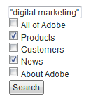

# 搜尋表格{#search-forms}

## 在搜尋表單中使用系列 {#reference_5A079AEEEFB84457892EF0870D0605C3}

系列可讓客戶搜尋您網站的特定區域。 視您實作下拉式清單或核取方塊清單而定，您可以讓客戶搜尋單一系列或多個系列。

另請參閱 [關於系列](../c-about-settings-menu/c-about-searching-menu.md#concept_62E42ACE53D54EEE9273433B86259127)。

下列範例顯示四個不同的系列名稱及其所涵蓋之網站的相關區域：

<table> 
 <thead> 
  <tr> 
   <th colname="col1" class="entry"> <p>系列名稱 </p> </th> 
   <th colname="col2" class="entry"> <p> </p> </th> 
  </tr> 
 </thead>
 <tbody> 
  <tr> 
   <td colname="col1"> <p>產品 </p> </td> 
   <td colname="col2"> <p> 
     <ul id="ul_7AE70789C0914EBFBCCC7695C6F53B9E"> 
      <li id="li_72525BAA34E2442D86152F2FD8CA83D5"> https://www.mycompany.com/products.htm </li> 
      <li id="li_5CA4152239124BDBB251E6C94B15D45B"> https://www.mycompany.com/publish/ </li> 
      <li id="li_6E266736B3494696A3AFD841C4AFEC57"> https://www.mycompany.com/search/ </li> 
     </ul> </p> </td> 
  </tr> 
  <tr> 
   <td colname="col1"> <p>客戶 </p> </td> 
   <td colname="col2"> <p>https://www.mycompany.com/customers/ </p> </td> 
  </tr> 
  <tr> 
   <td colname="col1"> <p>新聞 </p> </td> 
   <td colname="col2"> <p>https://www.mycompany.com/news/ </p> </td> 
  </tr> 
  <tr> 
   <td colname="col1"> <p>關於Adobe </p> </td> 
   <td colname="col2"> <p>https://www.mycompany.com/company/ </p> </td> 
  </tr> 
 </tbody> 
</table>

下拉式搜尋表單介面可讓使用者選取一個系列，如下所示：


下拉式搜尋表單會以下列HTML程式碼產生：

```
<select name="sp_k"> 
<option value="">All of Adobe</option> 
<option value="Products">Products</option> 
<option value="Customers">Customers</option> 
<option value="News">News</option> 
<option value="About Adobe">About Adobe</option> 
</select>
```

或者，您也可以在搜尋表單中使用一組核取方塊，讓訪客可以選取多個系列：



核取方塊搜尋表格會以下列HTML程式碼產生：

```
<input type="checkbox" name="sp_k" value="">All of Adobe<br> 
<input type="checkbox" name="sp_k" value="Products">Products<br> 
<input type="checkbox" name="sp_k" value="Customers">Customers<br> 
<input type="checkbox" name="sp_k" value="News">News<br> 
<input type="checkbox" name="sp_k" value="About Adobe">About Adobe<br>
```

## Search results {#section_BBDD5B44E2B349BC88D937F44583D350}

搜尋範本標 `<search-input-collections>` 簽會在搜尋結果中產生系列清單方塊HTML，並自動選取搜尋中指定的系列。 如果您想要產生核取方塊，請改用標 `<search-input>` 記，而非標 `<input>` 記，如下所示：

```
<search-input type="checkbox" name="sp_k" value="">All of Adobe<br> 
<search-input type="checkbox" name="sp_k" value="Products">Products<br> 
<search-input type="checkbox" name="sp_k" value="Customers">Customers<br> 
<search-input type="checkbox" name="sp_k" value="News">News<br> 
<search-input type="checkbox" name="sp_k" value="About Adobe">About Adobe<br>
```

如果 `<search-input>` 在搜尋中指 `<input>` 定系列，則標籤會輸出標 `checked` 記並包含屬性。

## 將框架與表單搭配使用 {#reference_82CDDDA1E37042E4849EBF7EA05407C5}

您可以設定您的框架集，以搭配網站搜尋／銷售運作。

若要進一步瞭解HTML影格和HTML影格集元素，請參閱下列URL:

[https://www.w3schools.com/html/html_frames.asp](https://www.w3schools.com/html/html_frames.asp)

如果您的網站使用框架，您可以為搜尋結果連結指定目標框架。 預設目標為_self，可在目前影格或瀏覽器視窗中開啟連結。 您可以改為指定網站特定或瀏覽器保留的目標：

* _top（瀏覽器保留）結果會在目前的瀏覽器視窗中開啟，並取代所有目前的影格。
* _blank（瀏覽器保留）結果會在新的瀏覽器視窗中開啟。
* _parent（瀏覽器保留）結果會在目前影格的父影格中開啟。
* frame2（網站特定）結果會在名為&quot;frame2&quot;的影格中開啟。 您可以指定任何影格的名稱為值（例如主要或內容）。

如果您的網站不使用框架，您最可能不想變更預設目標名稱。

如果您為網站建立自訂搜尋結果範本，您可以使用標籤的屬性來覆寫指 `target` 定的設 `<search-link>` 定。

配置框架集的過程如下：

<table> 
 <thead> 
  <tr> 
   <th colname="col1" class="entry"> <p>處理步驟 </p> </th> 
   <th colname="col02" class="entry"> <p>流程說明 </p> </th> 
   <th colname="col2" class="entry"> <p>連結 </p> </th> 
  </tr> 
 </thead>
 <tbody> 
  <tr> 
   <td colname="col1"> <p>1 </p> </td> 
   <td colname="col02"> <p>將表單新增至您網頁中所要的影格。 </p> </td> 
   <td colname="col2"> <p> <a href="#section_BAA8A502BB2243F8B5FF9783CDF2BFFD" type="section" format="dita" scope="local"> 將搜尋表單程式碼新增至您…… </a> </p> </td> 
  </tr> 
  <tr> 
   <td colname="col1"> <p>2 </p> </td> 
   <td colname="col02"> <p>為搜索結果頁設定目標框架。 </p> </td> 
   <td colname="col2"> <p> <a scope="local" href="#section_532CACB90888467093D95EACB64FDFA1" type="section" format="dita"> 為搜索結果頁設定目標框架 </a> </p> </td> 
  </tr> 
  <tr> 
   <td colname="col1"> <p>3 </p> </td> 
   <td colname="col02"> <p>為從搜尋結果頁面建立的連結設定目標。 </p> </td> 
   <td colname="col2"> <p> <a scope="local" href="#section_523248C5AC424D878321C21A23A5CD66" type="section" format="dita"> 設定從搜尋結果建立之連結的目標…… </a> </p> </td> 
  </tr> 
  <tr> 
   <td colname="col1"> <p>4 </p> </td> 
   <td colname="col02"> <p>編輯導覽影格頁面，防止其建立索引。 </p> </td> 
   <td colname="col2"> <p> <a scope="local" href="#section_C62E5F0EE1294D5EBD97E123E54433FC" type="section" format="dita"> 編輯導覽影格頁面，以防止它們…… </a> </p> </td> 
  </tr> 
  <tr> 
   <td colname="col1"> <p>5 </p> </td> 
   <td colname="col02"> <p>測試搜尋表格。 </p> </td> 
   <td colname="col2"> <p> <a scope="local" href="#section_43D8D4A7BF524DC480DFE5442F6A2E3C" type="section" format="dita"> 測試搜尋表單 </a> </p> </td> 
  </tr> 
 </tbody> 
</table>

## 將搜尋表單程式碼新增至網頁中的框架 {#section_BAA8A502BB2243F8B5FF9783CDF2BFFD}

1. 在產品功能表上，按一下 **[!UICONTROL Design]** > **[!UICONTROL Auto-Complete]** > **[!UICONTROL Form Source]**。

   HTML搜尋表單程式碼的外觀類似下列：

   ```
   <!-- Adobe Target HTML for [your customer name] --> 
   <form method="get" action="https://search.atomz.com/search/"> 
   <input size=15 name="sp_q"><br> 
   <input type=submit value="Search"> 
   <input type=hidden name="sp_a" value="[your account number]"> 
   </form>
   ```

1. 在頁面 [!DNL Standard Form Source] 上，選取並複製顯示在文字欄位中的HTML搜尋表單程式碼。
1. 將搜尋表單程式碼貼入您要在框架集中的框架中。

   在下列範例中，搜尋表單程式碼會貼入導覽影格——畫面左側的窄垂直影格。

   

## 為搜索結果頁設定目標框架 {#section_532CACB90888467093D95EACB64FDFA1}

如果您將搜尋表單程式碼如上所述置入垂直導覽影格中，則可在較大的主影格中顯示搜尋結果。 在此範例中，您將主影格稱為&quot;body&quot;，並將其設為目標影格。


1. 若要指定結果頁面的目標框架，請在搜尋表單程式碼中變更下列行，將目標和值新增至表單：

   `<form method="get" action="https://search.atomz.com/search/">`

   至下列項目：

   `<form target="body" method="get" action="https://search.atomz.com/search/">`

   請務必在表單目標值周圍加上引號。

當客戶對您的網站進行搜尋時，搜尋結果會出現在網頁的「內文」畫格中。

## 為從搜尋結果頁面建立的連結設定目標 {#section_523248C5AC424D878321C21A23A5CD66}

您可以直接編輯範本來設定目標影格。

如果您的搜尋結果出現在「body」影格中，您可能也想要在「body」影格中開啟連結。 因為這是相同的幀(即預設設 `"_self"` 置的目標值)，所以您不需要進行任何更改。

您也可以為結果連結設定目標影格。 以下是您可以做的幾個範例：

* 為搜尋結果及其連結指定不同的影格，如此當每個點按的結果在個別影格中開啟時，搜尋結果在其自己的影格中仍保持作用中。
* 指定搜尋結果會開啟至新的空白視窗，讓舊視窗在其原始內容中仍保持作用中，同時保留搜尋結果。

目標名稱可以是在HTML中指定的框架名稱，也可以是下列數個HTML預設值之一：

* `target="_blank"` 在新的空白未命名視窗中開啟連結。

* `target="_self"` 預設值. 在搜尋結果所在的相同視窗中開啟連結。 此時，將顯示原始搜索結果窗口。 使用此選項可覆蓋全局分配的基本目標。

* `target="_parent"` 在連結頁面的父框架集中開啟連結。 如果文檔沒有父項，則預設情況下，此功能 `"_self"` 類似。

* `target="_top"` 在完整視窗中開啟連結。 如果檔案已位於頂端，則預設會像 `"_self"` 樣運作。 使用此選項可突破任意深度的框架嵌套。

例如，若要設定目標 `_blank` 目標影格，您可以以下列方式編輯範本：

1. 在產品功能表上，按一下 **[!UICONTROL Design]** > **[!UICONTROL Templates]**。

1. 在頁 [!DNL Staged Templates] 面上，在表格中，按一下目標目標影格的範本名稱。
1. 找到標 `<search-link>` 記。 Your default `<search-link>` tag should look similar to the following:

   `<search-link><search-title length=100></search-link>`

1. 將影格目標新增至標 `<search-link>` 簽。 在上述示例中，輸入 `target="_blank"`。 請務必在目標值周圍加上底線和引號。

   標 `<search-link>` 記現在會如下所示：

   `<search-link target="_blank"><search-title length=100></search-link>`

當網站訪客選擇搜尋結果連結時，連結的頁面現在會開啟新的空白視窗。

## 編輯導覽影格頁面，防止其建立索引 {#section_C62E5F0EE1294D5EBD97E123E54433FC}

通常，您希望排除導覽框架，使其不能與搜索結果建立索引。 若要完成此功能，您可以將 `noindex` meta標籤新增至這些頁面。

1. 開啟導覽影格的HTML頁面來源。
1. 在HTML的區段內新增下 `<head>` 列meta標籤：

   `<meta name="robots" content="noindex">`

   例如:

   ```
   <html> 
   <head> 
   <title>This page is a frameset that I do not want indexed</title> 
   <meta http-equiv="Content-Type" content="text/html; charset=iso-8859-1"> 
   <meta name="robots" content="noindex"> 
   </head>
   ```

## 測試搜尋表單 {#section_43D8D4A7BF524DC480DFE5442F6A2E3C}

1. 前往您的網站並導覽至表單。
1. 在搜尋欄位中，輸入幾個搜尋詞，然後按一下 **[!UICONTROL Search]**。

   以下是正確的：

   * 搜尋結果頁面會顯示在指定的目標影格中。
   * 搜尋結果的連結位於指定的目標影格中。
   * 導覽影格結果不會出現。
   如果您在測試搜尋表單後遇到框架問題，請聯絡客戶支援。

## 進階搜尋表單範例 {#reference_82E1051918744EBA88A01E9E6AE42C4A}

您可以編輯進階表單程式碼，以符合您的設計和內容需求，或新增或移除其他搜尋參數。

您的首頁是插入進階搜尋表單的好地方，因為許多客戶都希望在此找到搜尋功能。 您也可以建立包含搜尋表單和其他實用資訊的HTML頁面，然後連結至整個網站的該頁面。

如果您正在為安全內容編製索引，則可以從安全搜索Web伺服器獲得搜索結果。 將搜尋表單動作屬性中的URL變更為：action=&quot;https://search.atomz.com/search/&quot;來執行此動作。

>[!NOTE]
>
>有些HTML編輯器無法從其他應用程式貼上HTML程式碼。 如果HTML程式碼以文字形式出現在您的網頁上，請將搜尋程式碼複製並貼入簡易的文字編輯器中，例如Windows上的記事本或Mac上的簡單文字，然後再從簡易文字編輯器複製並貼入HTML編輯器。

進階搜尋表單程式碼中會使用搜尋參數來建立選項按鈕、核取方塊和清單方塊，讓客戶可用來自訂個別搜尋。 例如，客戶可以指定顯示的搜尋結果數目，或日期範圍，或是透過顯示在進階搜尋表單上的選項，以搜尋結果顯示摘要。

使用下列範例進階搜尋表單，本主題的其餘部分會顯示如何使用搜尋參數建立表單上的每個選項。


您可以檢視上述範例的整個進階搜尋表單HTML程式碼。

請參閱 [進階搜尋表單HTML程式碼](#reference_9AAD4A46B68D4D48865508982CB86DB9)。

請參 [閱設定自動完成CSS](../c-about-auto-complete.md#task_EECE35DEB6C94F4A8A5B42B4DED76D96)。

請參 [閱將搜索表單的HTML代碼複製到……](../c-about-auto-complete.md#task_A3A01EA800F24C0AA33902387E0362C7).

<table> 
 <thead> 
  <tr> 
   <th colname="col2" class="entry"> <p>表單位置 </p> </th> 
   <th colname="col1" class="entry"> <p>參數 </p> </th> 
   <th colname="col3" class="entry"> <p>HTML程式碼 </p> </th> 
   <th colname="col4" class="entry"> <p>說明 </p> </th> 
  </tr> 
 </thead>
 <tbody> 
  <tr> 
   <td colname="col2"> <p>啟用進階搜尋表單選項（隱藏欄位） </p> </td> 
   <td colname="col1"> <p> <span class="codeph"> sp_advanced </span> </p> </td> 
   <td colname="col3"> <p> <span class="syntax html codeph"> &lt;input type=hidden name="sp_advanced" value=1&gt; </span> </p> </td> 
   <td colname="col4"> <p>啟用或禁用高級搜索選項。 例如，您可以在首頁上放置標準搜尋表單，其中包含第二頁的連結包含進階表單。 在這種情況下，您會將標準表單的副本放 <span class="codeph"> 入&lt;search-if-not-advanced&gt;...&lt;/search-if-not-advanced&gt;範本 </span> 標籤。 </p> <p>從標準表單執行搜尋的客戶在顯示搜尋結果時會看到標準搜尋表單。 在進階搜尋表單畫面上，您會將 <span class="codeph"> &lt;input type=hidden name="sp_advanced" value=1&gt;標籤與其他進階表單選項 </span> 一起加入。 </p> <p>您也可以在&lt;search-if-advanced&gt;中包含進階搜尋表單的副本……&lt;/search-if-advanced&gt;範本標籤。 從高級搜索表單執行搜索的客戶在顯示搜索結果時看到高級搜索表單。 </p> </td> 
  </tr> 
  <tr> 
   <td colname="col2"> <p> 比對任何、全部或片語 </p> </td> 
   <td colname="col1"> <p> <span class="codeph"> sp_p </span> </p> <p> </p> </td> 
   <td colname="col3"> <p> <code class="syntax html"> &lt;!--&nbsp;Allow&nbsp;"any,"&nbsp;"all,"&nbsp;or&nbsp;"phrase"&nbsp;--&gt; 
      &lt;input&nbsp;type=radio&nbsp;name="sp_p"&nbsp;value="any"&gt;Any&nbsp;word 
      &lt;input&nbsp;type=radio&nbsp;name="sp_p"&nbsp;value="all"&nbsp;checked&gt;All&nbsp;words 
      &lt;input&nbsp;type=radio&nbsp;name="sp_p"&nbsp;value="phrase"&gt;Exact&nbsp;phrase </code> </p> </td> 
   <td colname="col4"> <p>允許客戶指定「任何字詞」、「所有字詞」或「確切的片語」必須存在，才能比對檔案。 指定 <span class="codeph"> sp_p參 </span> 數時，客戶不需要在搜尋查詢中使用"+"、"-"或兩者。 </p> <p> 如果 <span class="codeph"> sp_p參 </span> 數被省略，或者設為""或"any"，則客戶仍然可以使用"+"和"-"說明符。 如果 <span class="codeph"> sp_p參 </span> 數設為"all"或"phrase"，則會忽略指定的"+"和"-"。 </p> <p>您可以進一步瞭解在搜尋中使用"+"和"-"。 </p> <p>請參閱<a href="../c-about-settings-menu/c-about-searching-menu.md#concept_207105CF26B1448F8A3D223787C56AB8" type="concept" format="dita" scope="local">關於搜尋</a>。 </p> </td> 
  </tr> 
  <tr> 
   <td colname="col2"> <p> 相似音效比對 </p> </td> 
   <td colname="col1"> <p> <span class="codeph"> sp_w </span> </p> <p>和 </p> <p> <span class="codeph"> sp_w_control </span> </p> <p> </p> </td> 
   <td colname="col3"> <p> <code class="syntax html"> &lt;!--&nbsp;Checkbox&nbsp;enables&nbsp;sound-alike&nbsp;matching&nbsp;--&gt; 
      &lt;input&nbsp;type=hidden&nbsp;name="sp_w_control"&nbsp;value=1&gt; 
      &lt;input&nbsp;type=checkbox&nbsp;name="sp_w"&nbsp;value="alike"&gt;&nbsp;Sound-alike&nbsp;matching </code> </p> </td> 
   <td colname="col4"> <p>可讓客戶啟用或停用類似音效的比對。 相似音效比對允許拼寫錯誤的搜尋查詢，以比對檔案中「相似音效」的字詞。 </p> <p>當sp_w_control參 <span class="codeph"> 數設為1且 </span><span class="codeph"></span> sp_w參數設為「alike」時，會選取產生的核取方塊，依預設啟用類似音效的比對。 </p> <p>如果 <span class="codeph"> sp_w參 </span> 數設定為""，則不選中該複選框。 </p> <p>如果您在最近的索引操作中未啟用相似音效比對，則無法進行相似音效比對， <span class="codeph"> sp_w </span> 參數會被忽略。 若要啟用相似音效比對，請在產品選單中按一下「 <span class="uicontrol"> 語言 </span> &gt;字詞與語言 <span class="uicontrol"> &gt;相似 </span> 音效比對」 <span class="uicontrol"></span>。 </p> <p>您也可以通過以 <span class="codeph"> 下方式指 </span> 派參 <span class="codeph"> 數sp_w和sp_w_control </span> 參數： </p> <p> <code class="syntax html"> &lt;!--&nbsp;Checkbox&nbsp;disables&nbsp;sound-alike&nbsp;matching&nbsp;--&gt; 
      &lt;input&nbsp;type=hidden&nbsp;name="sp_w_control"&nbsp;value=0&gt; 
      &lt;input&nbsp;type=checkbox&nbsp;name="sp_w"&nbsp;value="exact"&gt; 
      No&nbsp;sound-alike&nbsp;matching </code> </p> <p>在此情況下，當 <span class="codeph"> sp_w_control參數設 </span> 為0且 <span class="codeph"></span> sp_w參數設為「完全」時，預設情況下會禁用類似聲音的匹配。 如果 <span class="codeph"> sp_w參 </span> 數設為""，則會啟用類似音效比對。 </p> </td> 
  </tr> 
  <tr> 
   <td colname="col2"> <p>日期範圍比對 </p> </td> 
   <td colname="col1"> <p> <span class="codeph"> sp_d </span> </p> <p> </p> </td> 
   <td colname="col3"> <p> <code class="syntax html"> &lt;!--Specifies&nbsp;type&nbsp;of&nbsp;date&nbsp;range&nbsp;searching&nbsp;to&nbsp;perform.--&gt; 
      &lt;input&nbsp;type=radio&nbsp;name="sp_d"&nbsp;value="custom"&nbsp;checked&gt; 
      &lt;input&nbsp;type=radio&nbsp;name="sp_d"&nbsp;value="specific"&gt; </code> </p> </td> 
   <td colname="col4"> <p>sp_d <span class="codeph"> 參數指定 </span> 要執行的自訂資料範圍符合或要執行的特定日期範圍符合。 </p> <p>在預設的進階搜尋表單中，此選項會以選項按鈕群組的形式呈現，其中包含「自訂」日期範圍的下拉式清單，如同 <span class="codeph"> sp_date_range參數所 </span> 產生。 它還包括一組與 <span class="codeph"> sp_start_day、 </span>sp_start_month、 <span class="codeph"> sp_start_year、 </span>sp_start_year、sp_end <span class="codeph"> Day、sp_end_month、 </span><span class="codeph"></span><span class="codeph"></span><span class="codeph"></span> sp_end_end_year參數一起生成的「特定」起始日期和終止日期。 </p> <p>「自訂」日期範圍是要搜尋的指定日期範圍。 例如，「Anytime」、「Today」、「Within the last ign」等。 </p> <p>「特定」日期範圍包含開始日期和結束日期。 例如，從「2009年9月8日到2011年10月18日」。 </p> </td> 
  </tr> 
  <tr> 
   <td colname="col2"> <p>日期範圍符合：自訂日期範圍 </p> </td> 
   <td colname="col1"> <p> <span class="codeph"> sp_date_range </span> </p> <p> </p> </td> 
   <td colname="col3"> <p> <code class="syntax html"> &lt;!--Selection&nbsp;list&nbsp;for&nbsp;custom&nbsp;date&nbsp;range.--&gt; 
      &lt;select&nbsp;name="sp_date_range"&nbsp;size=1&gt; 
      &lt;option&nbsp;value=-1&nbsp;selected&gt;Anytime&lt;/option&gt; 
      &lt;option&nbsp;value=7&gt;Within&nbsp;the&nbsp;last&nbsp;week&lt;/option&gt; 
      &lt;option&nbsp;value=14&gt;Within&nbsp;the&nbsp;last&nbsp;2&nbsp;weeks&lt;/option&gt; 
      &lt;option&nbsp;value=30&gt;Within&nbsp;the&nbsp;last&nbsp;30&nbsp;days&lt;/option&gt; 
      &lt;option&nbsp;value=60&gt;Within&nbsp;the&nbsp;last&nbsp;60&nbsp;days&lt;/option&gt; 
      &lt;option&nbsp;value=90&gt;Within&nbsp;the&nbsp;last&nbsp;90&nbsp;days&lt;/option&gt; 
      &lt;option&nbsp;value=180&gt;Within&nbsp;the&nbsp;last&nbsp;180&nbsp;days&lt;/option&gt; 
      &lt;option&nbsp;value=365&gt;Within&nbsp;the&nbsp;last&nbsp;year&lt;/option&gt; 
      &lt;option&nbsp;value=730&gt;Within&nbsp;the&nbsp;last&nbsp;two&nbsp;years&lt;/option&gt; 
      &lt;/select&gt; </code> </p> </td> 
   <td colname="col4"> <p>sp_ <span class="codeph"> date_range參 </span> 數可用來建立「自訂」日期範圍。 例如，「Anytime」、「Today」、「Within the last in ay」等。 </p> <p>大於或等於零的值指定今天之前要搜索的天數。 例如，值0指定「今天」，值1指定「今天」和「昨天」，值30指定「最近30天內」，依此類推。 小於零的值會指定自訂範圍，如下所示： </p> <p> 
     <ul id="ul_E65DDE33883F441F9730F315E485AD98"> 
      <li id="li_83E9466AB9D7438A8544001F6B007186"> <p>-1 = "Anytime"，與指定無日期範圍相同。 </p> </li> 
      <li id="li_38AB8D97179A47F9B860A96EA09119BB"> <p>-2 = "本週"，在當周的週日到週六搜尋。 </p> </li> 
      <li id="li_F4C3A8658428418A8A06FBAAB4733C68"> <p>-3 = "上週"，在當周前一週的星期日到星期六進行搜尋。 </p> </li> 
      <li id="li_DF2D0B043A4E4DE9BE8D82E69A76E793"> <p>-4 = "本月"，搜尋當月日期。 </p> </li> 
      <li id="li_76BC4C2CED574E2A81448158828BFF1B"> <p>-5 = "上個月"，搜尋當月前一個月的日期。 </p> </li> 
      <li id="li_17FF849384FB46D58AF6FF1D3BC408C8"> <p>-6 = 「今年」，其搜索日期在當年。 </p> </li> 
      <li id="li_E2B8B4DFF3914BBDB86D0EB77F52B305"> <p>-7 = "去年"，其搜索日期在當年前一年。 </p> </li> 
     </ul> </p> </td> 
  </tr> 
  <tr> 
   <td colname="col2"> <p>日期範圍符合：開始日期 </p> </td> 
   <td colname="col1"> <p> <span class="codeph"> sp_start_day、sp_start_month、sp_start_year </span> </p> <p> </p> </td> 
   <td colname="col3"> </td> 
   <td colname="col4"> <p>此三分數值指定要搜尋的特定日期範圍的開始日期。 請確定您指定了這三個值，因為會忽略部分指定的日期。 </p> <p>只指定開始日期、結束日期或開始日期和結束日期都是合法的。 如果只指定了開始日期，則搜索將包括日期在開始日期或之後的匹配文檔。 如果只指定結束日期，搜尋會包含結束日期或結束日期之前的相符檔案。 如果同時指定了開始日期和結束日期，則搜索將包括從開始日期到結束日期的匹配文檔。 </p> <p>所有日期都會相對於格林威治標準時間進行搜尋。 </p> </td> 
  </tr> 
  <tr> 
   <td colname="col2"> <p> 日期範圍符合：結束日期 </p> </td> 
   <td colname="col1"> <p> <span class="codeph"> sp_end_day、sp_end_month、sp_end_year </span> </p> <p> </p> </td> 
   <td colname="col3"> </td> 
   <td colname="col4"> <p>此三分數值指定要搜尋的特定日期範圍的結束日期。 請確定您指定了這三個值，因為會忽略部分指定的日期。 </p> <p>只指定開始日期、結束日期或開始和結束日期都是合法的。 如果只指定了開始日期，則搜索將包括日期在開始日期或之後的匹配文檔。 如果只指定結束日期，搜尋會包含結束日期或結束日期之前的相符檔案。 如果同時指定了開始和結束日期，則搜索將包括從開始日期到結束日期的匹配文檔。 </p> <p>所有日期都會相對於格林威治標準時間進行搜尋。 </p> </td> 
  </tr> 
  <tr> 
   <td colname="col2"> <p>在搜尋欄位中 </p> </td> 
   <td colname="col1"> <p> <span class="codeph"> sp_x </span> </p> </td> 
   <td colname="col3"> <p> <code class="syntax html"> &lt;!--&nbsp;List&nbsp;box&nbsp;selects&nbsp;the&nbsp;search&nbsp;field&nbsp;--&gt; 
      Within&nbsp;&lt;select&nbsp;name="sp_x"&nbsp;size=1&gt; 
      &lt;option&nbsp;value="any"&nbsp;selected&gt;Anywhere&lt;/option&gt; 
      &lt;option&nbsp;value="title"&gt;Title&lt;/option&gt; 
      &lt;option&nbsp;value="desc"&gt;Description&lt;/option&gt; 
      &lt;option&nbsp;value="keys"&gt;Keywords&lt;/option&gt; 
      &lt;option&nbsp;value="body"&gt;Body&lt;/option&gt; 
      &lt;option&nbsp;value="alt"&gt;Alternate&nbsp;text&lt;/option&gt; 
      &lt;option&nbsp;value="url"&gt;URL&lt;/option&gt; 
      &lt;option&nbsp;value="target"&gt;Target&lt;/option&gt; 
      &lt;option&nbsp;value="date"&gt;Date&lt;/option&gt;* 
      &lt;/select&gt; </code> </p> </td> 
   <td colname="col4"> <p>sp_ <span class="codeph"> x清單方 </span> 塊可讓您的客戶指定要在其中搜尋查詢字串的欄位。 </p> <p>客戶可以選擇所有欄位、標題、檔案說明、檔案關鍵字、內文、替代文字、檔案的URL、日期或目標關鍵字。 </p> <p>使用 <span class="codeph"></span> sp_x參數時，客戶不需要在搜尋查詢字串中指定「title:」、「desc:」、「keys:」、「body:」、「alt:」、「url:」和「target:」。 </p> <p>如果 <span class="codeph"> 省略sp_x </span> 參數，或將其設為""或"any"，則客戶仍然可以使用欄位指定字串。 如果 <span class="codeph"> sp_x參 </span> 數設定為特定欄位，則忽略所有其他欄位指定符字串。 </p> <p>請參閱<a href="../c-about-settings-menu/c-about-searching-menu.md#concept_207105CF26B1448F8A3D223787C56AB8" type="concept" format="dita" scope="local">關於搜尋</a>。 </p> </td> 
  </tr> 
  <tr> 
   <td colname="col2"> <p>顯示結果計數 </p> </td> 
   <td colname="col1"> <p> <span class="codeph"> sp_c </span> </p> </td> 
   <td colname="col3"> <p> <code class="syntax html"> &lt;!--&nbsp;List&nbsp;box&nbsp;selects&nbsp;number&nbsp;of&nbsp;results&nbsp;to&nbsp;show&nbsp;per&nbsp;page&nbsp;--&gt; 
      Show&nbsp;&lt;select&nbsp;name="sp_c"&nbsp;size=1&gt; 
      &lt;option&nbsp;value=5&gt;5&lt;/option&gt; 
      &lt;option&nbsp;value=10&nbsp;selected&gt;10&lt;/option&gt; 
      &lt;option&nbsp;value=25&gt;25&lt;/option&gt; 
      &lt;option&nbsp;value=50&gt;50&lt;/option&gt; 
      &lt;option&nbsp;value=100&gt;100&lt;/option&gt; 
      &lt;/select&gt;&nbsp;results </code> </p> </td> 
   <td colname="col4"> <p>可讓客戶選擇每個搜尋結果頁面上顯示的搜尋結果數目。 </p> <p>表單中可以有您想要的選擇，也可以是最少的。 請確定"value="值與顯示的值相符。 </p> </td> 
  </tr> 
  <tr> 
   <td colname="col2"> <p>顯示或隱藏摘要 </p> </td> 
   <td colname="col1"> <p> <span class="codeph"> sp_m </span> </p> </td> 
   <td colname="col3"> <p> <code class="syntax html"> &lt;!--&nbsp;Show&nbsp;or&nbsp;hide&nbsp;summaries&nbsp;in&nbsp;search&nbsp;results&nbsp;--&gt; 
      &lt;select&nbsp;name="sp_m"&nbsp;size=1&gt; 
      &lt;option&nbsp;value=1&nbsp;selected&gt;with&lt;/option&gt; 
      &lt;option&nbsp;value=0&gt;without&lt;/option&gt; 
      &lt;/select&gt;&nbsp;summaries&nbsp; </code> </p> </td> 
   <td colname="col4"> <p>可讓客戶選擇是否針對每個相符項目顯示摘要文字。 </p> <p>如果要顯示摘要，請將值設定為1。 如果要隱藏摘要，請將值設為0。 您也可以搭配一組選項按鈕使用參數，如下列範例所示： </p> <p> <code class="syntax html"> &lt;!--&nbsp;Show&nbsp;or&nbsp;hide&nbsp;summaries&nbsp;in&nbsp;search&nbsp;results&nbsp;--&gt; 
      &lt;input&nbsp;type=radio&nbsp;name="sp_m"&nbsp;value=1&nbsp;selected&gt;Show&nbsp;summaries 
      &lt;input&nbsp;type=radio&nbsp;name="sp_m"&nbsp;value=0&gt;Hide&nbsp;summaries </code> </p> </td> 
  </tr> 
  <tr> 
   <td colname="col2"> <p>依結果排序 </p> </td> 
   <td colname="col1"> <p> <span class="codeph"> sp_s </span> </p> </td> 
   <td colname="col3"> <p> <code class="syntax html"> &lt;!--&nbsp;Sort&nbsp;results&nbsp;by&nbsp;relevance&nbsp;or&nbsp;by&nbsp;date&nbsp;--&gt; 
      Sort&nbsp;by&nbsp;&lt;select&nbsp;name="sp_s"&nbsp;size=1&gt; 
      &lt;option&nbsp;value=0&nbsp;selected&gt;relevance&lt;/option&gt; 
      &lt;option&nbsp;value=1&gt;date&lt;/option&gt; 
      &lt;/select&gt; </code> </p> </td> 
   <td colname="col4"> <p>可讓客戶選擇結果是依相關性或日期排列。 </p> <p>當值設為1時，結果會從最近變更的檔案列出為最近變更的檔案。 當值設為0時，結果會從最相關和最不相關中列出。 您也可以搭配使用此參數與選項按鈕，如下列範例所示： </p> <p> <code class="syntax html"> &lt;!--&nbsp;Sort&nbsp;results&nbsp;by&nbsp;relevance&nbsp;or&nbsp;by&nbsp;date&nbsp;--&gt; 
      &lt;input&nbsp;type=radio&nbsp;name="sp_s"&nbsp;value=0&nbsp;selected&gt;Sort&nbsp;by&nbsp;relevance 
      &lt;input&nbsp;type=radio&nbsp;name="sp_s"&nbsp;value=1&gt;Sort&nbsp;by&nbsp;date </code> </p> </td> 
  </tr> 
 </tbody> 
</table>

## 進階搜尋表單HTML程式碼 {#reference_9AAD4A46B68D4D48865508982CB86DB9}

用於生成高級搜索表單的HTML表單代碼，該表單顯示在「示例高級搜索表單」主題的頂部。

請參 [閱範例進階搜尋表單](#reference_82E1051918744EBA88A01E9E6AE42C4A)。

如果您使用此代碼，請記得將 `sp_a` 值取 `sp99999999` 代為實際帳戶號碼。

若要尋找您的帳戶號碼，請在產品功能表上按一下 **[!UICONTROL Settings]** > **[!UICONTROL Account Options]** > **[!UICONTROL Account Settings]**。

```
<form method="get" action="https://search.atomz.com/search/"> 
<table cellspacing=0 cellpadding=0 border=0> 
<tr><td colspan=4> 
<b>Search For:</b><br> 
<input size=35 name="sp_q"> 
<!-- The "Search" button --> 
<input type=submit value="Search"> 
<input type=hidden name="sp_a" value="sp99999999"> 
<input type=hidden name="sp_f" value="ISO-8859-1"> 
</td></tr> 
<input type=hidden name="sp_advanced" value=1> 
<!-- Allow "any," "all," or "phrase" --> 
<tr><td valign=top> 
<b>Match: </b> 
</td><td colspan=4> 
<input type=radio name="sp_p" value="any">Any word 
<input type=radio name="sp_p" value="all" checked>All words 
<input type=radio name="sp_p" value="phrase">Exact phrase<br> 
<!-- Checkbox enables sound-alike matching --> 
<input type=hidden name="sp_w_control" value=1> 
<input type=checkbox name="sp_w" value="alike" checked> 
Sound-alike matching 
</td></tr> 
<!-- Date range criteria --> 
<tr><td><b>Dated:</b></td><td colspan=4> 
<input type=radio name="sp_d" value="custom" checked> 
<select name="sp_date_range" size=1> 
<option value=-1 selected>Anytime</option> 
<option value=7>Within the last week</option> 
<option value=14>Within the last 2 weeks</option> 
<option value=30>Within the last 30 days</option> 
<option value=60>Within the last 60 days</option> 
<option value=90>Within the last 90 days</option> 
<option value=180>Within the last 180 days</option> 
<option value=365>Within the last year</option> 
<option value=730>Within the last two years</option> 
</select> 
</td></tr> 
<tr><td></td><td rowspan=2> 
<input type=radio name="sp_d" value=specific> 
</td><td align=right>From:</td><td> 
<select name="sp_start_month" size=1> 
<option value=0 selected></option> 
<option value=1>January</option> 
<option value=2>February</option> 
<option value=3>March</option> 
<option value=4>April</option> 
<option value=5>May</option> 
<option value=6>June</option> 
<option value=7>July</option> 
<option value=8>August</option> 
<option value=9>September</option> 
<option value=10>October</option> 
<option value=11>November</option> 
<option value=12>December</option> 
</select> 
<select name="sp_start_day" size=1> 
<option value=0 selected></option> 
<option value=1>1</option> 
<option value=2>2</option> 
<option value=3>3</option> 
<option value=4>4</option> 
<option value=5>5</option> 
<option value=6>6</option> 
<option value=7>7</option> 
<option value=8>8</option> 
<option value=9>9</option> 
<option value=10>10</option> 
<option value=11>11</option> 
<option value=12>12</option> 
<option value=13>13</option> 
<option value=14>14</option> 
<option value=15>15</option> 
<option value=16>16</option> 
<option value=17>17</option> 
<option value=18>18</option> 
<option value=19>19</option> 
<option value=20>20</option> 
<option value=21>21</option> 
<option value=22>22</option> 
<option value=23>23</option> 
<option value=24>24</option> 
<option value=25>25</option> 
<option value=26>26</option> 
<option value=27>27</option> 
<option value=28>28</option> 
<option value=29>29</option> 
<option value=30>30</option> 
<option value=31>31</option> 
</select> 
<!--comma-->, 
<input size=4 name="sp_start_year"> 
</td></tr> 
<tr><td></td> 
<td align=right>To:</td><td> 
<select name="sp_end_month" size=1> 
<option value=0 selected></option> 
<option value=1>January</option> 
<option value=2>February</option> 
<option value=3>March</option> 
<option value=4>April</option> 
<option value=5>May</option> 
<option value=6>June</option> 
<option value=7>July</option> 
<option value=8>August</option> 
<option value=9>September</option> 
<option value=10>October</option> 
<option value=11>November</option> 
<option value=12>December</option> 
</select> 
<select name="sp_end_day" size=1> 
<option value=0 selected></option> 
<option value=1>1</option> 
<option value=2>2</option> 
<option value=3>3</option> 
<option value=4>4</option> 
<option value=5>5</option> 
<option value=6>6</option> 
<option value=7>7</option> 
<option value=8>8</option> 
<option value=9>9</option> 
<option value=10>10</option> 
<option value=11>11</option> 
<option value=12>12</option> 
<option value=13>13</option> 
<option value=14>14</option> 
<option value=15>15</option> 
<option value=16>16</option> 
<option value=17>17</option> 
<option value=18>18</option> 
<option value=19>19</option> 
<option value=20>20</option> 
<option value=21>21</option> 
<option value=22>22</option> 
<option value=23>23</option> 
<option value=24>24</option> 
<option value=25>25</option> 
<option value=26>26</option> 
<option value=27>27</option> 
<option value=28>28</option> 
<option value=29>29</option> 
<option value=30>30</option> 
<option value=31>31</option> 
</select> 
<!--comma-->, 
<input size=4 name="sp_end_year"> 
</td></tr> 
<!-- List box selects the search field --> 
<tr><td valign=top> 
<b>Within: </b> 
</td><td colspan=4><select name="sp_x" size=1> 
<option value="any" selected>Anywhere</option> 
<option value="title">Title</option> 
<option value="desc">Description</option> 
<option value="keys">Keywords</option> 
<option value="body">Body</option> 
<option value="alt">Alternate text</option> 
<option value="url">URL</option> 
<option value="target">Target</option> 
</select> 
</td></tr> 
<!-- List box selects number of results to show per page --> 
<tr><td valign=top> 
<b>Show: </b> 
</td><td colspan=4><select name="sp_c" size=1> 
<option value=5>5</option> 
<option value=10 selected>10</option> 
<option value=25>25</option> 
<option value=50>50</option> 
<option value=100>100</option> 
</select> results  
<!-- Show or hide summaries in search results --> 
<select name="sp_m" size=1> 
<option value=1 selected>with</option> 
<option value=0>without</option> 
</select> summaries<br> 
</td></tr> 
<!-- Sort results by relevance or by date --> 
<tr><td valign=top> 
<b>Sort by: </b> 
</td><td colspan=4><select name="sp_s" size=1> 
<option value=0 selected>relevance</option> 
<option value=1>date</option> 
</select> 
</td></tr> 
</table> 
</form>
```

## 進階搜尋表單範本代碼 {#reference_D762C22E754E462DBEECD88D2C3FA579}

您可以將進階搜尋表單HTML程式碼新增至範本，讓任何參數的預設選項與先前的搜尋相同。

換言之，如果客戶按一下選項按 **[!UICONTROL Exact phrase]** 鈕，您可以確保在顯示搜尋結果時，依預設選取選項按鈕。

此功能是透過從標準HTML標籤中移除所有「已勾選」或「選取」的指定符號，然後取代下列HTML標籤來完成：

* `<input>`
* `<select>`
* `<option>`
* `</option>`
* `</select>`

與下列對應的範本標籤：

* `<search-input>`
* `<search-select>`
* `<search-option>`
* `</search-option>`
* `</search-select>`

若要這麼做，請使用下列程式碼做為搜尋范 `<form>` 本上的標籤。

```
<!-- Adobe Target results section.--> 
 
<!-- Show heading and logo graphic. --> 
<SEARCH-IF-RESULTS> 
<b>SEARCH RESULTS <SEARCH-LOWER> - <SEARCH-UPPER></b> 
of <SEARCH-TOTAL> total results for <b><SEARCH-QUERY></b><br> 
</SEARCH-IF-RESULTS> 
<SEARCH-IF-NOT-RESULTS> 
<b>SEARCH RESULTS</b> for <b><SEARCH-QUERY></b><br> 
</SEARCH-IF-NOT-RESULTS> 
<SEARCH-LOGO><br> 
 
<!-- Display Results. --> 
<SEARCH-RESULTS LENGTH=160> 
<p><b><SEARCH-LINK><SEARCH-TITLE LENGTH=160></SEARCH-LINK></b><br> 
<SEARCH-IF-SHOW-SUMMARIES> 
<SEARCH-IF-CONTEXT LENGTH=240><SEARCH-CONTEXT><br></SEARCH-IF-CONTEXT> 
<font size="-1"><SEARCH-URL LENGTH=60></font><br> 
</SEARCH-IF-SHOW-SUMMARIES> 
</SEARCH-RESULTS> 
 
<!-- If no results, show a message. --> 
<SEARCH-IF-NOT-RESULTS><p> 
Sorry, no matches were found containing <b><SEARCH-QUERY>.</b> 
</SEARCH-IF-NOT-RESULTS> 
<!-- Show By Relevance, By Date links, Show/Hide Summaries links. --> 
<SEARCH-IF-RESULTS><p> 
<SEARCH-IF-SORT-BY-DATE> 
<b><SEARCH-SORT-BY-SCORE COUNT=10>Sort By Relevance</SEARCH-SORT-BY-SCORE></b> 
</SEARCH-IF-SORT-BY-DATE> 
<SEARCH-IF-SORT-BY-SCORE> 
<b><SEARCH-SORT-BY-DATE COUNT=10>Sort By Date</SEARCH-SORT-BY-DATE></b> 
</SEARCH-IF-SORT-BY-SCORE> 
| <b> 
<SEARCH-IF-SHOW-SUMMARIES> 
<SEARCH-HIDE-SUMMARIES COUNT=20>Hide Summaries</SEARCH-HIDE-SUMMARIES> 
</SEARCH-IF-SHOW-SUMMARIES> 
<SEARCH-IF-HIDE-SUMMARIES> 
<SEARCH-SHOW-SUMMARIES COUNT=10>Show Summaries</SEARCH-SHOW-SUMMARIES> 
</SEARCH-IF-HIDE-SUMMARIES> 
</b><br> 
</SEARCH-IF-RESULTS> 
 
<!-- Display Prev & Next links. --> 
<SEARCH-IF-RESULTS> 
<SEARCH-IF-PREV-COUNT> 
<b><SEARCH-PREV>Prev <SEARCH-PREV-COUNT></SEARCH-PREV></b> 
<SEARCH-IF-NEXT-COUNT> | </SEARCH-IF-NEXT-COUNT> 
</SEARCH-IF-PREV-COUNT> 
<SEARCH-IF-NEXT-COUNT> 
<b><SEARCH-NEXT>Next <SEARCH-NEXT-COUNT></SEARCH-NEXT></b><br> 
</SEARCH-IF-NEXT-COUNT><p> 
</SEARCH-IF-RESULTS> 
 
<!-- Put up the next form. --> 
<form method="get" action="https://search.atomz.com/search/"> 
<SEARCH-IF-NOT-ADVANCED> 
<SEARCH-INPUT-ACCOUNT> 
<SEARCH-INPUT-GALLERY> 
<SEARCH-INPUT-QUERY SIZE=25> 
<SEARCH-INPUT type=hidden name=sp_p> 
<input type=submit value="New Search"> 
<SEARCH-IF-INPUT-COLLECTIONS> 
<br><SEARCH-INPUT-COLLECTIONS> 
</SEARCH-IF-INPUT-COLLECTIONS> 
</SEARCH-IF-NOT-ADVANCED> 
<SEARCH-IF-ADVANCED> 
<table cellspacing=0 cellpadding=0 border=0> 
<tr><td colspan=4> 
<b>Search For:</b><br> 
<SEARCH-INPUT-QUERY SIZE=35> 
 
<!-- The "Search" button --> 
<input type=submit value="New Search"> 
<SEARCH-INPUT-ACCOUNT> 
<SEARCH-INPUT-GALLERY> 
</td></tr> 
<SEARCH-IF-INPUT-COLLECTIONS> 
<!-- Collections --> 
<tr><td> 
<b>In: </b> 
</td><td colspan=4> 
<SEARCH-INPUT-COLLECTIONS> 
</td></tr> 
</SEARCH-IF-INPUT-COLLECTIONS> 
<input type=hidden name="sp_advanced" value=1> 
 
<!-- Allow "any," "all," or "phrase" --> 
<tr><td valign=top> 
<b>Match: </b> 
</td><td colspan=4> 
<SEARCH-INPUT type=radio name="sp_p" value="any">Any word 
<SEARCH-INPUT type=radio name="sp_p" value="all">All words 
<SEARCH-INPUT type=radio name="sp_p" value="phrase">Exact phrase<br> 
<!-- Checkbox enables sound-alike matching --> 
<input type=hidden name="sp_w_control" value=1> 
<SEARCH-INPUT type=checkbox name="sp_w" value="alike">Sound-alike matching 
</td></tr> 
 
<!-- Date range section --> 
<tr> 
<td><b>Dated:</b></td> 
<td colspan=3> 
<SEARCH-INPUT type=radio name="sp_d" value="custom"> 
<SEARCH-SELECT name="sp_date_range" size=1> 
<SEARCH-OPTION value=-1>Anytime</SEARCH-OPTION> 
<SEARCH-OPTION value=7>Within the last week</SEARCH-OPTION> 
<SEARCH-OPTION value=14>Within the last 2 weeks</SEARCH-OPTION> 
<SEARCH-OPTION value=30>Within the last 30 days</SEARCH-OPTION> 
<SEARCH-OPTION value=60>Within the last 60 days</SEARCH-OPTION> 
<SEARCH-OPTION value=90>Within the last 90 days</SEARCH-OPTION> 
<SEARCH-OPTION value=180>Within the last 180 days</SEARCH-OPTION> 
<SEARCH-OPTION value=365>Within the last year</SEARCH-OPTION> 
<SEARCH-OPTION value=730>Within the last two years</SEARCH-OPTION> 
</SEARCH-SELECT> 
</td></tr> 
<tr><td></td><td rowspan=2> 
<SEARCH-INPUT type=radio name="sp_d" value=specific></td> 
<td align=right>From:</td><td> 
<SEARCH-SELECT name="sp_start_month" size=1> 
<SEARCH-OPTION value=0></SEARCH-OPTION> 
<SEARCH-OPTION value=1>January</SEARCH-OPTION> 
<SEARCH-OPTION value=2>February</SEARCH-OPTION> 
<SEARCH-OPTION value=3>March</SEARCH-OPTION> 
<SEARCH-OPTION value=4>April</SEARCH-OPTION> 
<SEARCH-OPTION value=5>May</SEARCH-OPTION> 
<SEARCH-OPTION value=6>June</SEARCH-OPTION> 
<SEARCH-OPTION value=7>July</SEARCH-OPTION> 
<SEARCH-OPTION value=8>August</SEARCH-OPTION> 
<SEARCH-OPTION value=9>September</SEARCH-OPTION> 
<SEARCH-OPTION value=10>October</SEARCH-OPTION> 
<SEARCH-OPTION value=11>November</SEARCH-OPTION> 
<SEARCH-OPTION value=12>December</SEARCH-OPTION> 
</SEARCH-SELECT> 
<SEARCH-SELECT name="sp_start_day" size=1> 
<SEARCH-OPTION value=0></SEARCH-OPTION> 
<SEARCH-OPTION value=1>1</SEARCH-OPTION> 
<SEARCH-OPTION value=2>2</SEARCH-OPTION> 
<SEARCH-OPTION value=3>3</SEARCH-OPTION> 
<SEARCH-OPTION value=4>4</SEARCH-OPTION> 
<SEARCH-OPTION value=5>5</SEARCH-OPTION> 
<SEARCH-OPTION value=6>6</SEARCH-OPTION> 
<SEARCH-OPTION value=7>7</SEARCH-OPTION> 
<SEARCH-OPTION value=8>8</SEARCH-OPTION> 
<SEARCH-OPTION value=9>9</SEARCH-OPTION> 
<SEARCH-OPTION value=10>10</SEARCH-OPTION> 
<SEARCH-OPTION value=11>11</SEARCH-OPTION> 
<SEARCH-OPTION value=12>12</SEARCH-OPTION> 
<SEARCH-OPTION value=13>13</SEARCH-OPTION> 
<SEARCH-OPTION value=14>14</SEARCH-OPTION> 
<SEARCH-OPTION value=15>15</SEARCH-OPTION> 
<SEARCH-OPTION value=16>16</SEARCH-OPTION> 
<SEARCH-OPTION value=17>17</SEARCH-OPTION> 
<SEARCH-OPTION value=18>18</SEARCH-OPTION> 
<SEARCH-OPTION value=19>19</SEARCH-OPTION> 
<SEARCH-OPTION value=20>20</SEARCH-OPTION> 
<SEARCH-OPTION value=21>21</SEARCH-OPTION> 
<SEARCH-OPTION value=22>22</SEARCH-OPTION> 
<SEARCH-OPTION value=23>23</SEARCH-OPTION> 
<SEARCH-OPTION value=24>24</SEARCH-OPTION> 
<SEARCH-OPTION value=25>25</SEARCH-OPTION> 
<SEARCH-OPTION value=26>26</SEARCH-OPTION> 
<SEARCH-OPTION value=27>27</SEARCH-OPTION> 
<SEARCH-OPTION value=28>28</SEARCH-OPTION> 
<SEARCH-OPTION value=29>29</SEARCH-OPTION> 
<SEARCH-OPTION value=30>30</SEARCH-OPTION> 
<SEARCH-OPTION value=31>31</SEARCH-OPTION> 
</SEARCH-SELECT><!--comma-->, 
<SEARCH-INPUT size=4 name="sp_start_year"> 
</td></tr> 
<tr><td></td> 
<td align=right>To:</td><td> 
<SEARCH-SELECT name="sp_end_month" size=1> 
<SEARCH-OPTION value=0></SEARCH-OPTION> 
<SEARCH-OPTION value=1>January</SEARCH-OPTION> 
<SEARCH-OPTION value=2>February</SEARCH-OPTION> 
<SEARCH-OPTION value=3>March</SEARCH-OPTION> 
<SEARCH-OPTION value=4>April</SEARCH-OPTION> 
<SEARCH-OPTION value=5>May</SEARCH-OPTION> 
<SEARCH-OPTION value=6>June</SEARCH-OPTION> 
<SEARCH-OPTION value=7>July</SEARCH-OPTION> 
<SEARCH-OPTION value=8>August</SEARCH-OPTION> 
<SEARCH-OPTION value=9>September</SEARCH-OPTION> 
<SEARCH-OPTION value=10>October</SEARCH-OPTION> 
<SEARCH-OPTION value=11>November</SEARCH-OPTION> 
<SEARCH-OPTION value=12>December</SEARCH-OPTION> 
</SEARCH-SELECT> 
<SEARCH-SELECT name="sp_end_day" size=1> 
<SEARCH-OPTION value=0></SEARCH-OPTION> 
<SEARCH-OPTION value=1>1</SEARCH-OPTION> 
<SEARCH-OPTION value=2>2</SEARCH-OPTION> 
<SEARCH-OPTION value=3>3</SEARCH-OPTION> 
<SEARCH-OPTION value=4>4</SEARCH-OPTION> 
<SEARCH-OPTION value=5>5</SEARCH-OPTION> 
<SEARCH-OPTION value=6>6</SEARCH-OPTION> 
<SEARCH-OPTION value=7>7</SEARCH-OPTION> 
<SEARCH-OPTION value=8>8</SEARCH-OPTION> 
<SEARCH-OPTION value=9>9</SEARCH-OPTION> 
<SEARCH-OPTION value=10>10</SEARCH-OPTION> 
<SEARCH-OPTION value=11>11</SEARCH-OPTION> 
<SEARCH-OPTION value=12>12</SEARCH-OPTION> 
<SEARCH-OPTION value=13>13</SEARCH-OPTION> 
<SEARCH-OPTION value=14>14</SEARCH-OPTION> 
<SEARCH-OPTION value=15>15</SEARCH-OPTION> 
<SEARCH-OPTION value=16>16</SEARCH-OPTION> 
<SEARCH-OPTION value=17>17</SEARCH-OPTION> 
<SEARCH-OPTION value=18>18</SEARCH-OPTION> 
<SEARCH-OPTION value=19>19</SEARCH-OPTION> 
<SEARCH-OPTION value=20>20</SEARCH-OPTION> 
<SEARCH-OPTION value=21>21</SEARCH-OPTION> 
<SEARCH-OPTION value=22>22</SEARCH-OPTION> 
<SEARCH-OPTION value=23>23</SEARCH-OPTION> 
<SEARCH-OPTION value=24>24</SEARCH-OPTION> 
<SEARCH-OPTION value=25>25</SEARCH-OPTION> 
<SEARCH-OPTION value=26>26</SEARCH-OPTION> 
<SEARCH-OPTION value=27>27</SEARCH-OPTION> 
<SEARCH-OPTION value=28>28</SEARCH-OPTION> 
<SEARCH-OPTION value=29>29</SEARCH-OPTION> 
<SEARCH-OPTION value=30>30</SEARCH-OPTION> 
<SEARCH-OPTION value=31>31</SEARCH-OPTION> 
</SEARCH-SELECT><!--comma-->, 
<SEARCH-INPUT size=4 name="sp_end_year"> 
</td></tr> 
<!-- List box selects the search field --> 
<tr><td valign=top> 
<b>Within: </b> 
</td><td colspan=4><SEARCH-SELECT name="sp_x" size=1> 
<SEARCH-OPTION value="any">Anywhere</SEARCH-OPTION> 
<SEARCH-OPTION value="title">Title</SEARCH-OPTION> 
<SEARCH-OPTION value="desc">Description</SEARCH-OPTION> 
<SEARCH-OPTION value="keys">Keywords</SEARCH-OPTION> 
<SEARCH-OPTION value="body">Body</SEARCH-OPTION> 
<SEARCH-OPTION value="alt">Alternate text</SEARCH-OPTION> 
<SEARCH-OPTION value="url">URL</SEARCH-OPTION> 
<SEARCH-OPTION value="target">Target</SEARCH-OPTION> 
</SEARCH-SELECT></td></tr> 
<!-- List box selects number of results to show per page --> 
<tr><td valign=top> 
<b>Show:</b> 
</td><td colspan=4><SEARCH-SELECT name="sp_c" size=1> 
<SEARCH-OPTION value=5>5</SEARCH-OPTION> 
<SEARCH-OPTION value=10>10</SEARCH-OPTION> 
<SEARCH-OPTION value=25>25</SEARCH-OPTION> 
<SEARCH-OPTION value=50>50</SEARCH-OPTION> 
<SEARCH-OPTION value=100>100</SEARCH-OPTION> 
</SEARCH-SELECT> results  
<!-- Show or hide summaries in search results --> 
<SEARCH-SELECT name="sp_m" size=1> 
<SEARCH-OPTION value=1>with</SEARCH-OPTION> 
<SEARCH-OPTION value=0>without</SEARCH-OPTION> 
</SEARCH-SELECT> summaries<br></td></tr> 
<!-- Sort results by relevance or by date --> 
<tr><td valign=top> 
<b>Sort by: </b> 
</td><td colspan=4><SEARCH-SELECT name="sp_s" size=1> 
<SEARCH-OPTION value=0>relevance</SEARCH-OPTION> 
<SEARCH-OPTION value=1>date</SEARCH-OPTION> 
</SEARCH-SELECT></td></tr> 
</table> 
</SEARCH-IF-ADVANCED> 
</form>
```

